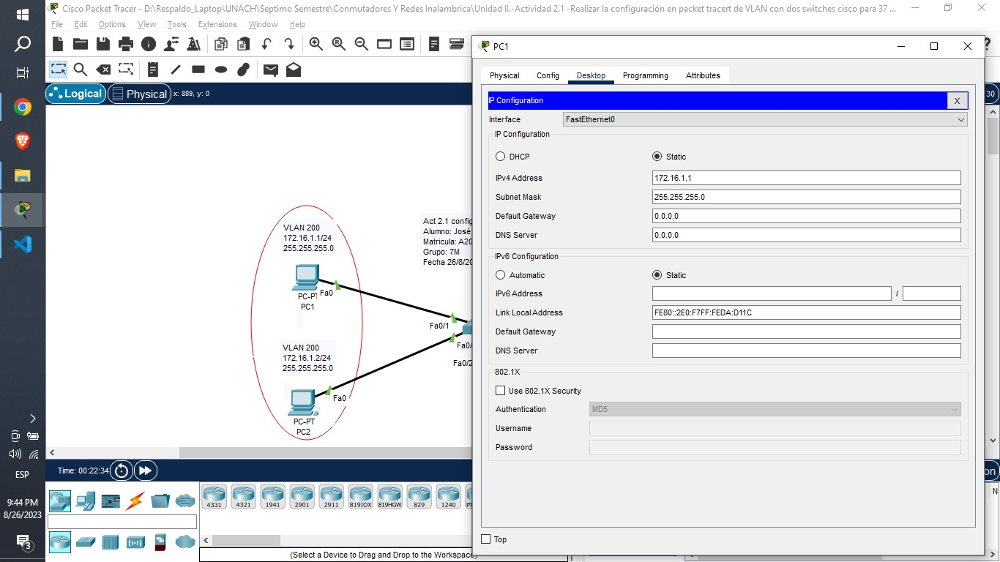
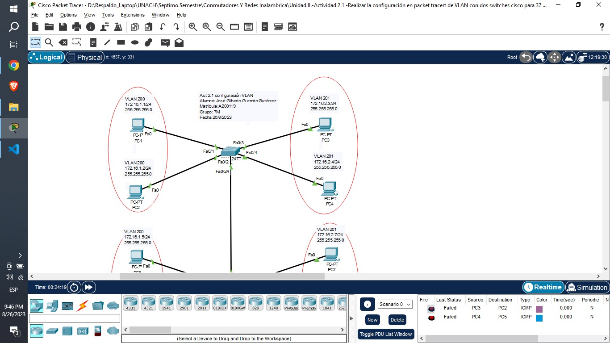

# Configuración de Cisco Packet Tracert

### 1. Asignación de IPs

Nota: Esto se debe de repetir con cada uno de los equipos.

### 2. Asignación de nombres

    Switch>ena
    Switch#conf t
    Enter configuration commands, one per line.  End with CNTL/Z.
    Switch(config)#hostname S1
    S1(config)#vlan 200
    S1(config-vlan)#name software
    S1(config-vlan)#exit
    S1(config)#vlan 201
    S1(config-vlan)#name sistemas
    S1(config-vlan)#exit
    S1(config)#

    Switch>ena
    Switch#conf t
    Enter configuration commands, one per line.  End with CNTL/Z.
    Switch(config)#hostname S2
    S2(config)#vlan 200
    S2(config-vlan)#name software
    S2(config-vlan)#exit
    S2(config)#vlan 201
    S2(config-vlan)#name sistemas
    S2(config-vlan)#exit
    S2(config)#

### 3. Configuramos a las vlans

    S1>ena
    S1#conf t
    Enter configuration commands, one per line.  End with CNTL/Z.
    S1(config)#interface range fastEthernet 0/1 - 2
    S1(config-if-range)#switchport mode access
    S1(config-if-range)#switchport access vlan 200
    S1(config-if-range)#exit

    S1>ena
    S1#conf t
    Enter configuration commands, one per line.  End with CNTL/Z.
    S1(config)#interface range fastEthernet 0/3 - 4
    S1(config-if-range)#switchport mode access
    S1(config-if-range)#switchport access vlan 201
    S1(config-if-range)#exit

    S1(config)#inter f 0/24
    S1(config-if)#switchport mode trunk
    S1(config-if)#exit

    S2>ena
    S2#conf t
    Enter configuration commands, one per line.  End with CNTL/Z.
    S2(config)#interface range fastEthernet 0/5 - 6
    S2(config-if-range)#switchport mode access
    S2(config-if-range)#switchport access vlan 200
    S2(config-if-range)#exit
    S2(config)#

    S2>ena
    S2#conf t
    Enter configuration commands, one per line.  End with CNTL/Z.
    S2(config)#interface range fastEthernet 0/7 - 8
    S2(config-if-range)#switchport mode access
    S2(config-if-range)#switchport access vlan 201
    S2(config-if-range)#exit

    S2(config)#inter f 0/24
    S2(config-if)#switchport mode trunk
    S2(config-if)#exit

### 4. Comprobación de resultados

Se **permite la comunicación** entre los equipos que forman parte de la misma vlan.

Se **restringe la comunicación** entre los equipos que no forman parte de la misma vlan.

# Carpeta de Github

aaa