# Problemática.

De forma individual, realizar un presupuesto cuanto se gastaría para realizar un cableado estructurado para un laboratorio de computo.

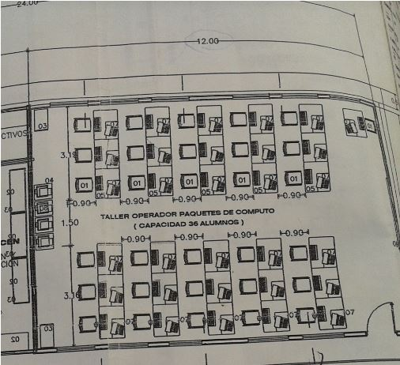

Importante: La imagen proporcionada menciona que el salón tiene una capacidad para 36 alumnos; sin embargo, el número de máquinas mostradas en el plano es de 31, 30 para los alumnos y 1 para el profesor. Por lo tanto, se trabajará considerando que hay 31 máquinas disponibles.

## Conexión Alámbrica:

### Cotización 1

| Nombre | Descripción | Imagen | Url | Precio | Cantidad | Marca | Modelo | Total |
| ------ | ----------- | ------ | --- | ------ | -------- | ----- | ------ | ----- |
| Cable UTP CAT5e | Consta de varios pares de hilos de cobre trenzados entre sí para reducir la interferencia electromagnética. Cada par de hilos transporta una señal en direcciones opuestas, lo que disminuye las posibles interferencias. El CAT5e es capaz de soportar velocidades de transmisión de hasta 1 Gbps (gigabit por segundo) en distancias relativamente cortas, como hasta 100 metros.  | 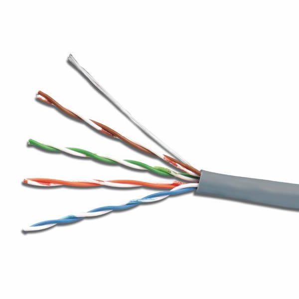 | https://ecatalog.siemon.com/#/en/Copper/Cable/Category-5e-UTP-Cable-North-America | $800 el carrete de 305m | ≈85m | Siemon | Cat5e | ≈$223 |
| Plug RJ45 CAT5e | Está diseñado específicamente para utilizarse con cables UTP CAT5e. Su diseño y configuración aseguran una conexión adecuada para la transmisión de datos a velocidades de hasta 1 Gbps. | 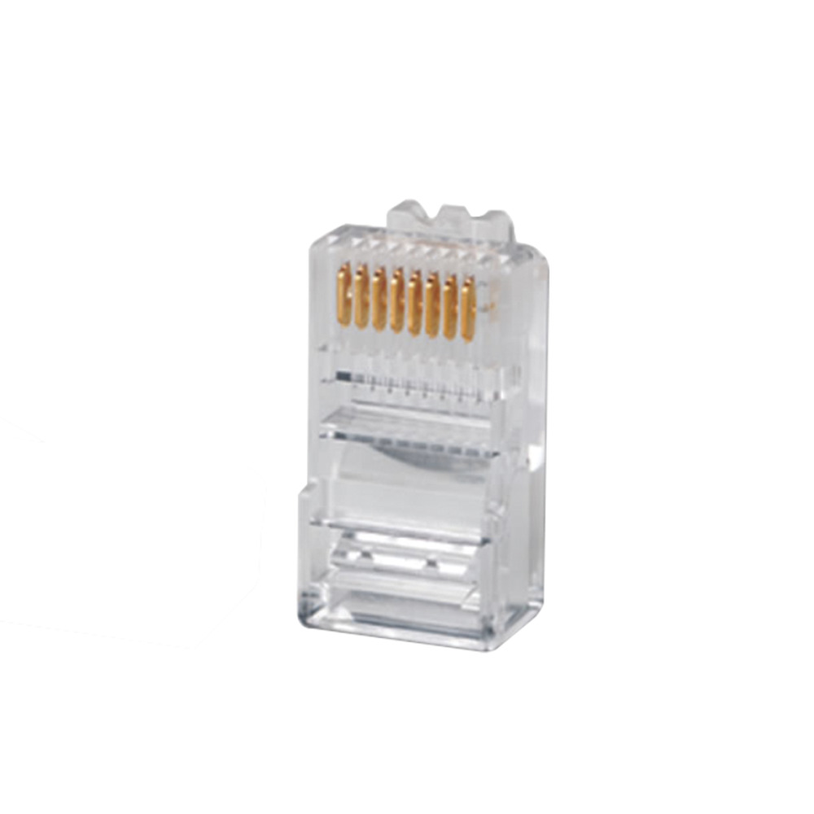 | https://www.syscom.mx/producto/P-8-8-SIEMON-91459.html | $15 | 62 | Siemon | Cat5e | $930 |
| Divisor tipo Y | Es un dispositivo que divide una única señal de red en múltiples salidas, permitiendo conectar varios dispositivos a través de un solo cable de red. | 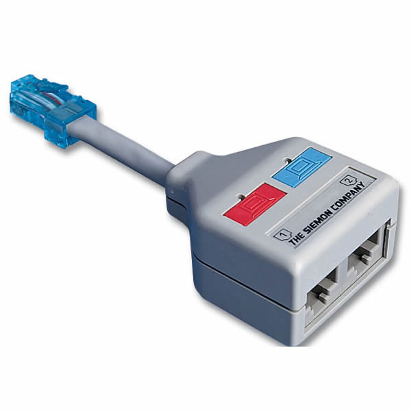 | https://ecatalog.siemon.com/#/en/Work-Area/Accessories/Y-Adapters | $100 | 30 | Siemon | Splitter | $3000 |

Nota: El uso de divisores limita la velocidad de red a 100 Mbps, por ende esta configuración es recomendable para módems de 100 Mbps o menos de velocidad, caso contrario cheque la siguiente cotización.

### Diagrama

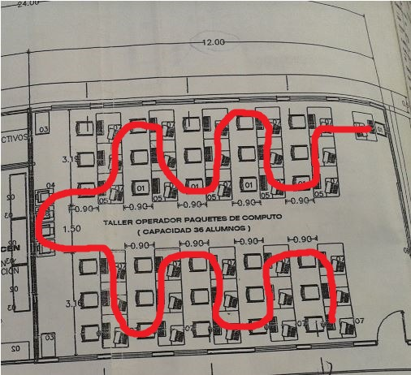

### Cotización 2

| Nombre | Descripción | Imagen | Url | Precio | Cantidad | Marca | Modelo | Total |
| ------ | ----------- | ------ | --- | ------ | -------- | ----- | ------ | ----- |
| Cable UTP CAT6 | Se refiere a un tipo de cable de par trenzado no blindado (Unshielded Twisted Pair en inglés) que cumple con la especificación de categoría 6. Este tipo de cable es ampliamente utilizado en redes de datos para transmitir señales de alta velocidad y alto rendimiento, como Ethernet. | 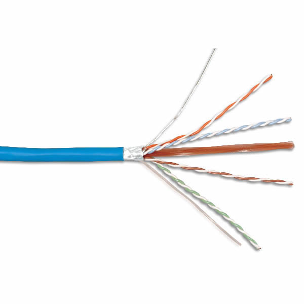 | https://ecatalog.siemon.com/#/en/Copper/Cable/Category-6A-Shielded-Cable-North-America | $1200 el carrete de 305m | ≈120m | Siemon | Cat6 | ≈$472 |
| Plug RJ45 CAT6 | Es el conector modular de 8 pines utilizado para terminar los extremos de los cables UTP CAT6. Este conector sigue el estándar de conectores RJ45 y está diseñado específicamente para trabajar con cables de categoría 6. |  | https://www.cyberpuerta.mx/Computo-Hardware/Cables/Accesorios-para-Cables/Conectores/Siemon-Conector-RJ-45-para-Cable-UTP-Cat6-Transparente-50-Piezas.html | $20 | 62 | Siemon | Cat5e | $930 |
| Switch Gigabit Ethernet | Es un dispositivo de red que opera en capa 2 del modelo OSI (Open Systems Interconnection) y permite conectar varios dispositivos en una red local (LAN) para facilitar la comunicación y el intercambio de datos a velocidades de hasta 1 gigabit por segundo (Gbps). | 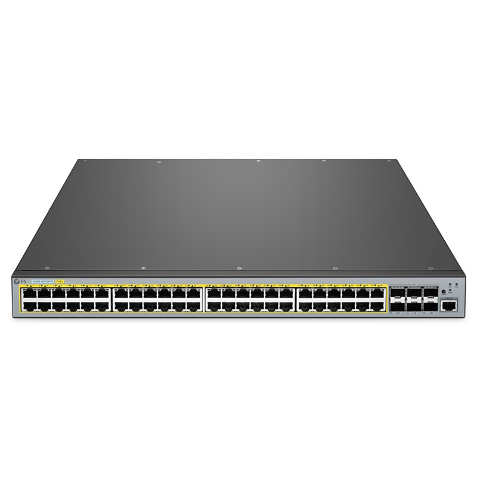 | https://www.fs.com/mx/products/149749.html?country=MX&currency=MXN&languages=Espa%C3%B1ol&paid=google_shopping&utm_country=1010031&gclid=CjwKCAjwxOymBhAFEiwAnodBLHdACZ2vsVfXNfGAwXoISrFjWZPdQyhgn_iCDymoHg5l_l5N8SbIzRoCoUoQAvD_BwE | $32360 | 1 | Siemon | S5500-48T6SP-R | $32360 |

### Diagrama

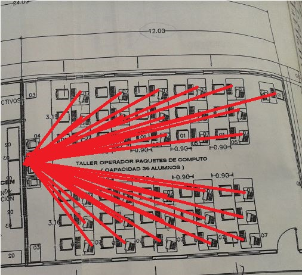

## Conexión Inálambrica

### Cotización 3

| Nombre | Descripción | Imagen | Url | Precio | Cantidad | Marca | Modelo | Total |
| ------ | ----------- | ------ | --- | ------ | -------- | ----- | ------ | ----- |
| Access Point  | Permite la conexión inalámbrica de dispositivos a una red de área local (LAN) mediante la tecnología Wi-Fi. Actúa como un puente entre los dispositivos inalámbricos, como computadoras portátiles, teléfonos inteligentes, tabletas y otros dispositivos, y la red cableada subyacente. | 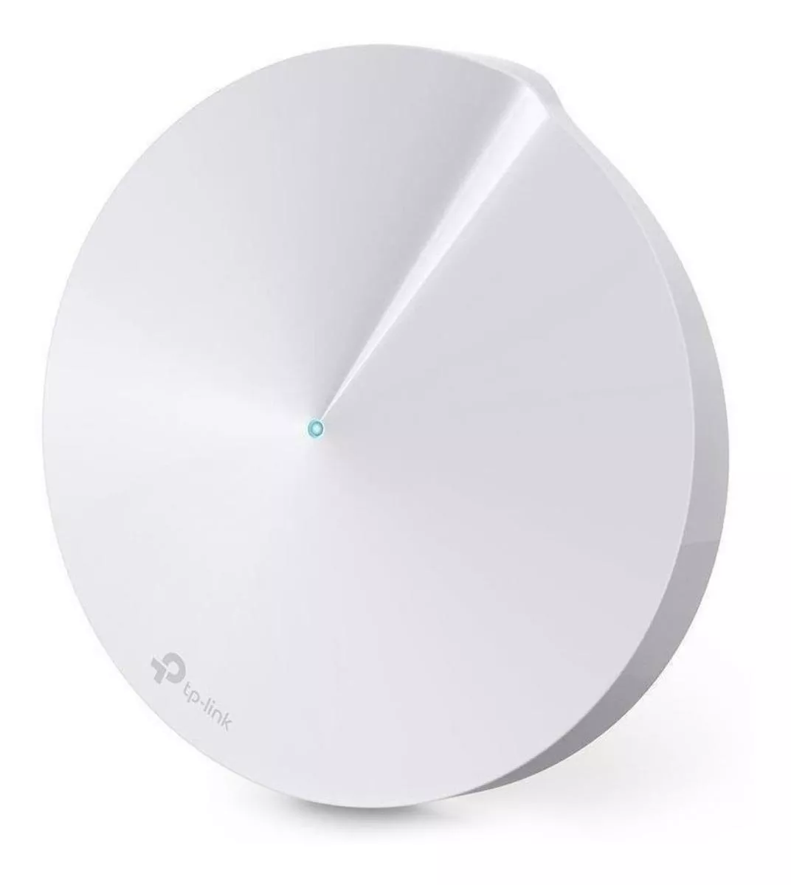 | https://www.mercadolibre.com.mx/access-point-router-sistema-wi-fi-mesh-tp-link-deco-m5-blanco-100v240v/p/MLM17331207?pdp_filters=category:MLM5015#searchVariation=MLM17331207&position=4&search_layout=stack&type=product&tracking_id=72e307c7-7b64-44e5-809e-a1748f9b32ce | $1300 | 1 | TP Link | Deco | $1300 |
| Tarjeta de red para PC | Es un componente hardware que permite que una computadora se conecte a una red, ya sea mediante conexiones cableadas o inalámbricas. La tarjeta de red es esencial para que una computadora pueda comunicarse con otros dispositivos y recursos en una red, como otros equipos, servidores, impresoras y recursos compartidos | 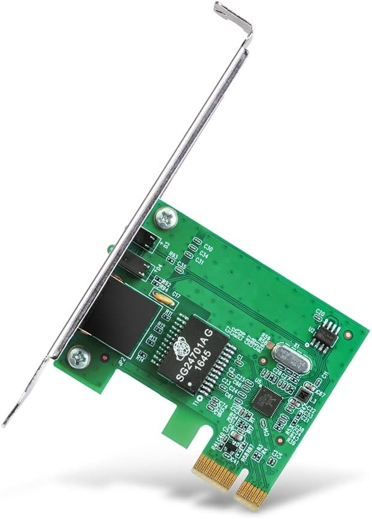 | https://www.mercadolibre.com.mx/access-point-router-sistema-wi-fi-mesh-tp-link-deco-m5-blanco-100v240v/p/MLM17331207?pdp_filters=category:MLM5015#searchVariation=MLM17331207&position=4&search_layout=stack&type=product&tracking_id=72e307c7-7b64-44e5-809e-a1748f9b32ce | $300 | 31 | TP Link | TG-3468 | $9300 |

Nota: El uso de una red inalambrica si bien nos proove de una mayor flexibilidad, actualmente estas tienen mas interrupciones y una velocidad menor, esto comparandolo con una conexión alambrica.

### Diagrama

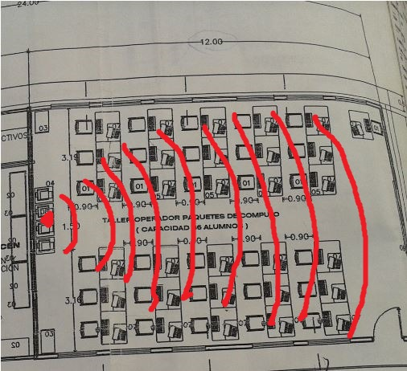