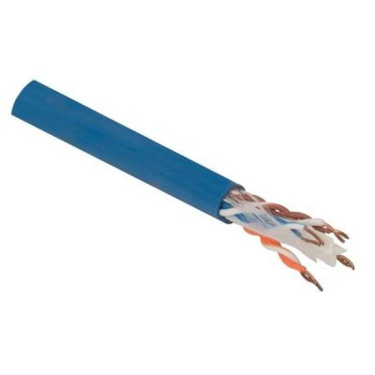
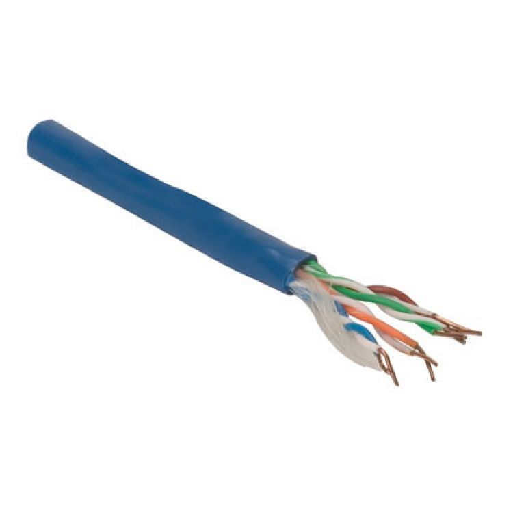
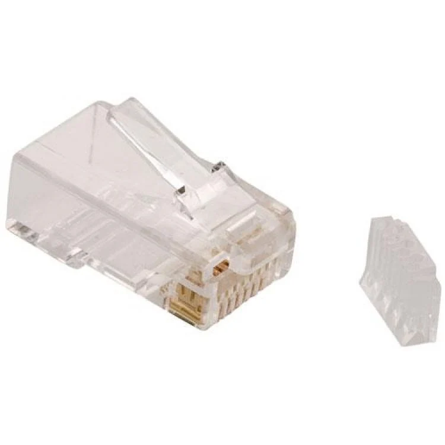
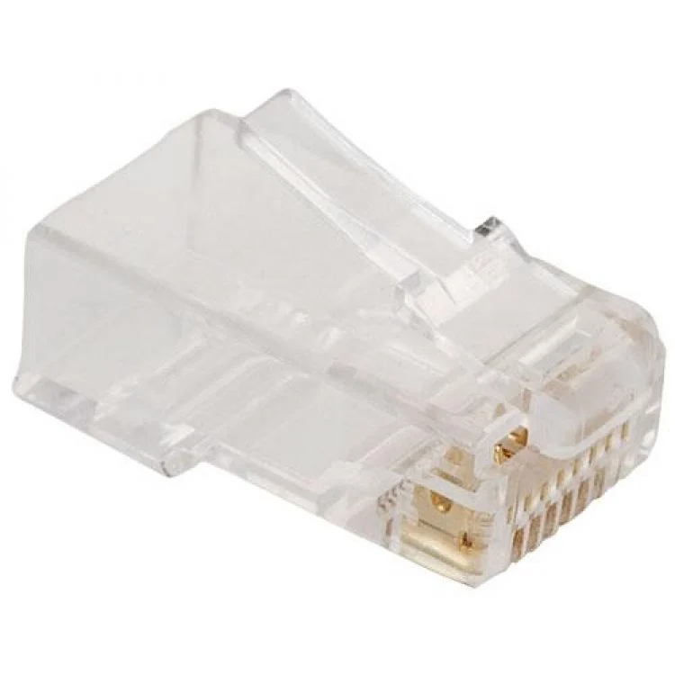
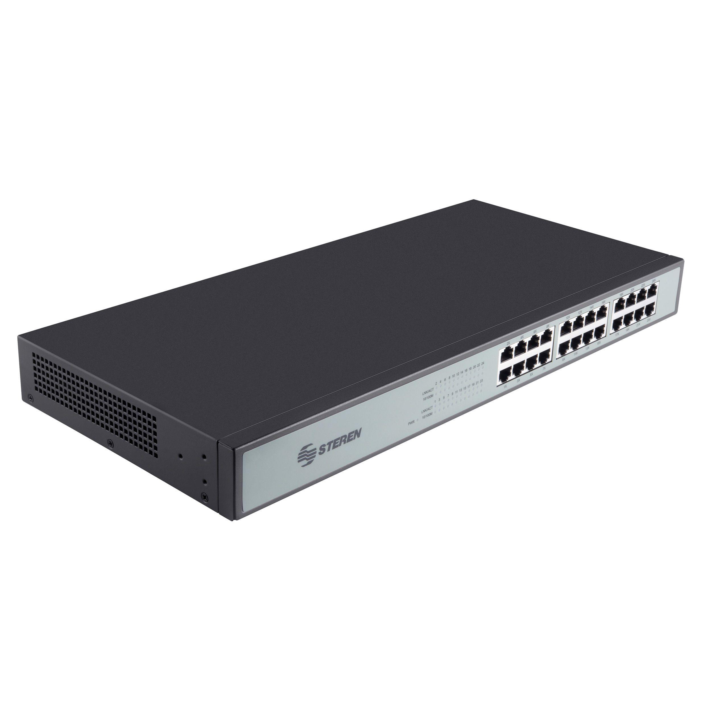
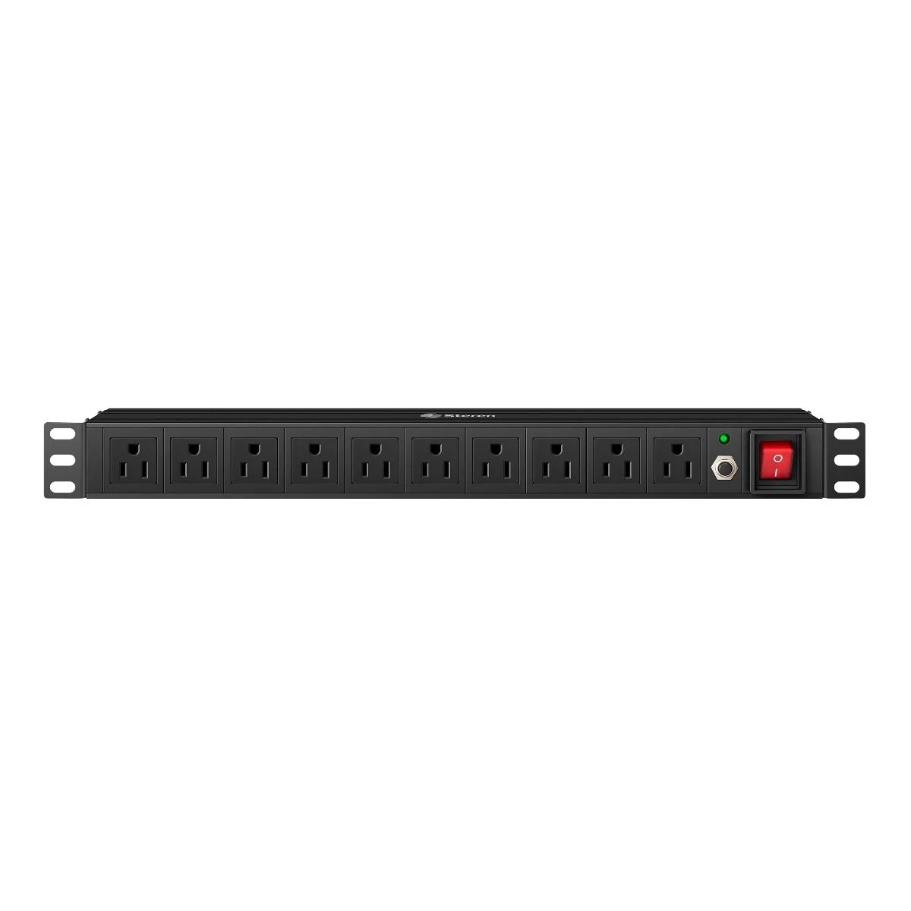
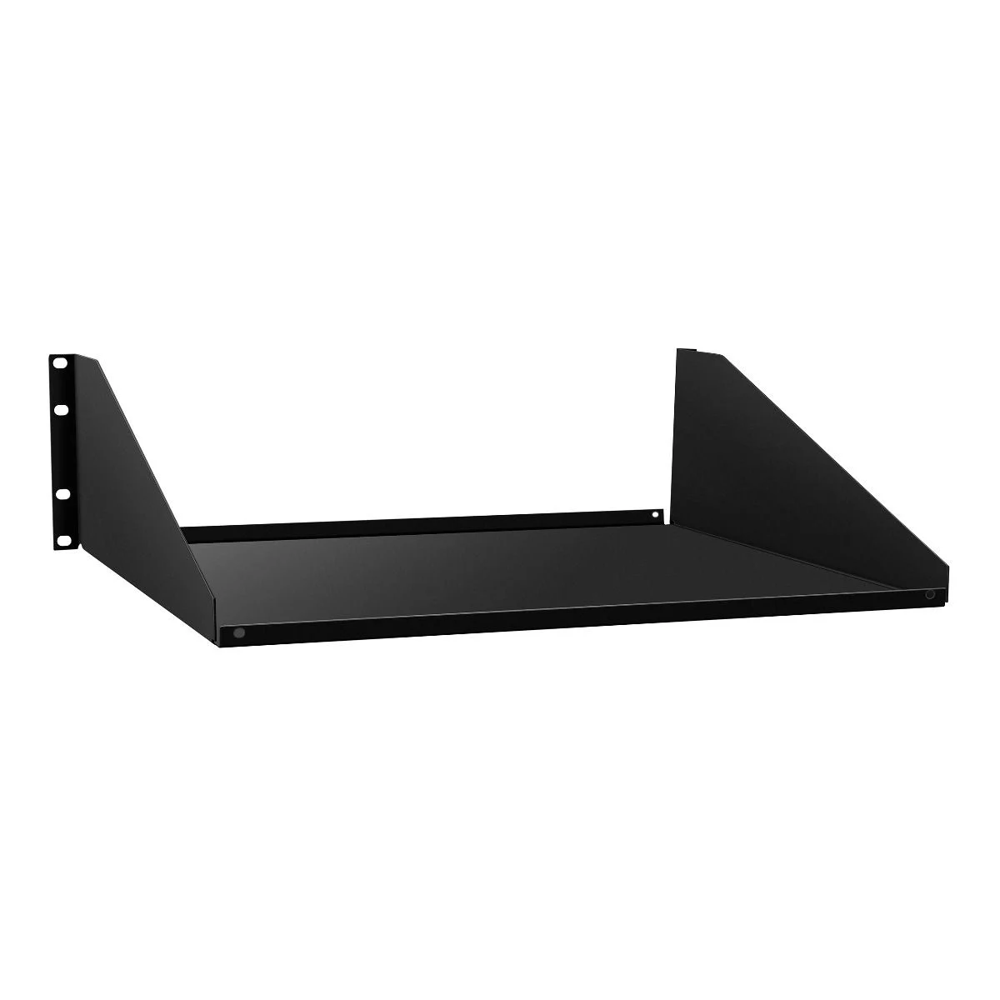
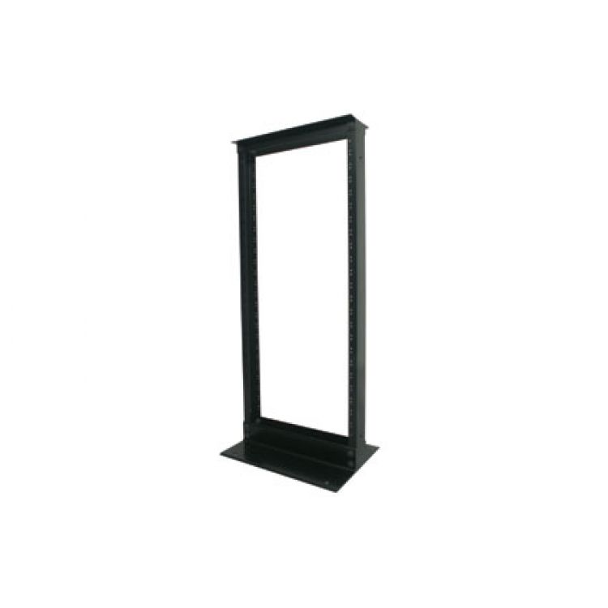
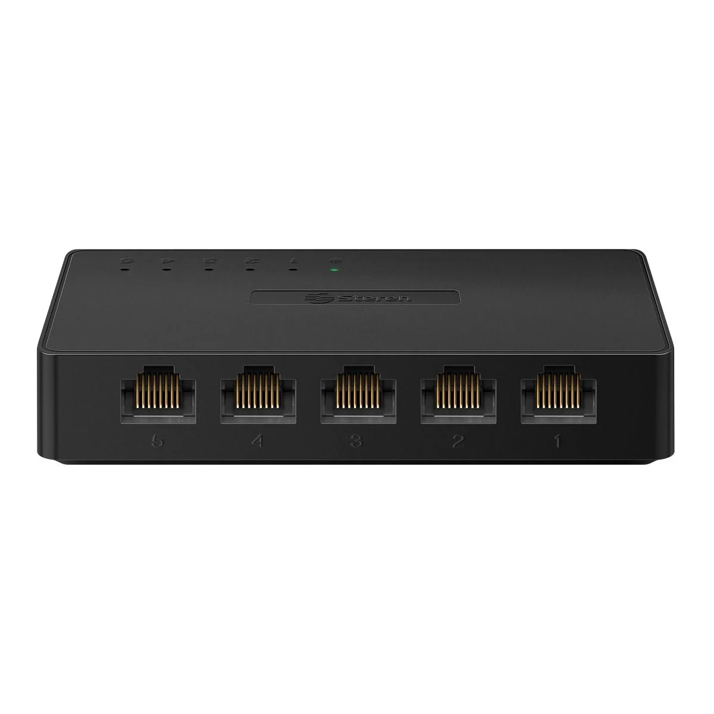
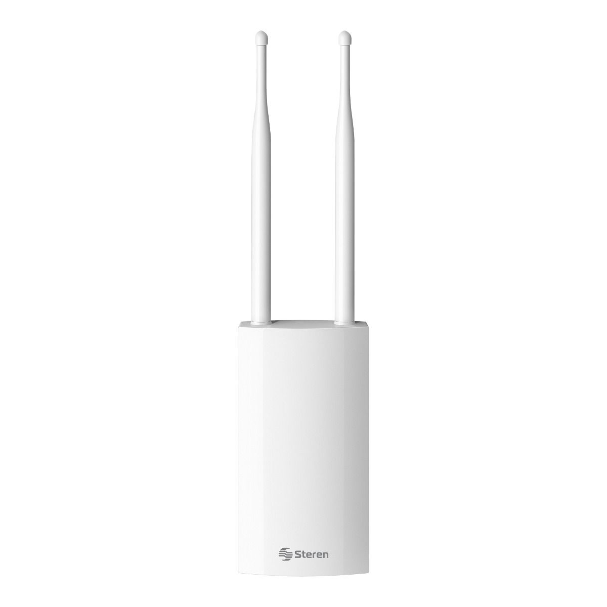

# Problemática.

Definir los requisitos para la conexión de 50 equipos de computo a internet.

## Conexión Alámbrica:

| Nombre | Descripción | Imagen | Url | Precio | Cantidad | Marca | Modelo | Total |
| ------ | ----------- | ------ | --- | ------ | -------- | ----- | ------ | ----- |
| Cable UTP CAT6 | Un cable de par trenzado no blindado (UTP) de categoría 6 (CAT6) es un tipo de cable utilizado para la transmisión de datos en redes de alta velocidad. Está diseñado para soportar velocidades de hasta 10 Gbps y proporciona una mayor capacidad de ancho de banda y menos interferencia que los cables CAT5e. Es comúnmente utilizado en redes empresariales y entornos de alta demanda de datos. |  | https://www.steren.com.mx/cable-utp-cat6-color-azul-vta.html | $22 - 1m | Dependerá de las dimensiones del establecimiento | Steren | UTP6-305 VTA | $22 - 1m |
| Cable UTP CAT5e | Un cable de par trenzado no blindado (UTP) de categoría 5e (CAT5e) es un tipo de cable diseñado para la transmisión de datos en redes Ethernet. Ofrece velocidades de hasta 1 Gbps y es adecuado para la mayoría de aplicaciones de redes locales. Proporciona una buena relación entre costo y rendimiento y es ampliamente utilizado en entornos comerciales y domésticos. |  | https://www.steren.com.mx/cable-utp-cat5e-color-azul-vta.html | $14 - 1m | Dependerá de las dimensiones del establecimiento | Steren | UTP5E-AZ-305 VTA | $14 - 1m |
| Plug RJ45 CAT6 | Un conector RJ45 CAT6 es un enchufe utilizado para conectar cables Ethernet, específicamente cables UTP de categoría 6. Está diseñado para garantizar una conexión segura y de alta velocidad en redes que requieren un rendimiento superior. |  | https://www.steren.com.mx/plug-rj45-de-8-contactos-cat-6-para-cable-redondo.html | $9 c/u | 106 | Steren | 301-180 | $954 |
| Plug RJ45 CAT5e | Un conector RJ45 CAT5e es un enchufe utilizado para conectar cables Ethernet, específicamente cables UTP de categoría 5e. Está diseñado para proporcionar una conexión confiable y de alta velocidad en redes locales y es compatible con velocidades de hasta 1 Gbps. |  | https://www.steren.com.mx/plug-rj45-de-8-contactos-cat-5e-para-cable-redondo.html | $5 c/u | 106 | Steren | 301-178 | $530 |
| Switch Fast Ethernet | Un switch de Fast Ethernet es un dispositivo de red que opera en la tecnología Ethernet y puede transmitir datos a velocidades de hasta 100 Mbps. Aunque ha sido superado por estándares de mayor velocidad como Gigabit Ethernet, los switches Fast Ethernet aún pueden ser utilizados en redes donde no se requiere una velocidad tan alta. |  | https://www.steren.com.mx/switch-fast-ethernet-de-24-puertos.html | $1390 c/u | 3 | Steren | SWI-024 | $4170 |
| Multicontacto Para Rack | Un multicontacto para rack es un dispositivo de distribución eléctrica diseñado para ser montado en un rack de equipos. Proporciona múltiples tomas de corriente para conectar equipos electrónicos en un entorno de centro de datos o sala de servidores. |  | https://www.steren.com.mx/multicontacto-de-10-salidas-horizontales-para-rack-de-19.html | $995 c/u | 1 | Steren | MOR-015 | $995 |
| Charola Para Rack | Una charola para rack es una plataforma plana que se monta en un rack de equipos. Se utiliza para sostener equipos, dispositivos o accesorios que no son aptos para ser montados directamente en el rack. Ayuda a organizar el espacio y a mantener los componentes ordenados. |  | https://www.steren.com.mx/charola-grande-para-montaje-en-rack.html | $799 c/u | 3 | Steren | MOR-S2(N) | $2397 |
| Rack Vertical | Un rack vertical es una estructura de almacenamiento para equipos electrónicos que se coloca en posición vertical. Está diseñado para optimizar el uso del espacio en entornos donde el espacio horizontal es limitado. Los equipos se montan en los paneles frontales del rack vertical y se organizan de manera compacta. |  | https://www.steren.com.mx/rack-vertical-para-el-armado-de-sistemas-de-video-voz-o-datos.html | $4490 c/u | 1 | Steren | MOR-84(N) | $4490 |

Nota: La elección entre cable UTP y Jack RJ45, ya sea CAT5e o CAT6, dependerá de las dimensiones del establecimiento, siendo que CAT5e usualmente provee una mayor distancia máxima, mientras que CAT6 ofrece una mayor velocidad de transferencia.

## Diagrama:

## Conexión Inalámbrica:

| Nombre | Descripción | Imagen | Url | Precio | Cantidad | Marca | Modelo | Total |
| ------ | ----------- | ------ | --- | ------ | -------- | ----- | ------ | ----- |
| Cable UTP CAT6 | Un cable de par trenzado no blindado (UTP) de categoría 6 (CAT6) es un tipo de cable utilizado para la transmisión de datos en redes de alta velocidad. Está diseñado para soportar velocidades de hasta 10 Gbps y proporciona una mayor capacidad de ancho de banda y menos interferencia que los cables CAT5e. Es comúnmente utilizado en redes empresariales y entornos de alta demanda de datos. |  | https://www.steren.com.mx/cable-utp-cat6-color-azul-vta.html | $22 - 1m | Dependerá de las dimensiones del establecimiento | Steren | UTP6-305 VTA | $22 - 1m |
| Cable UTP CAT5e | Un cable de par trenzado no blindado (UTP) de categoría 5e (CAT5e) es un tipo de cable diseñado para la transmisión de datos en redes Ethernet. Ofrece velocidades de hasta 1 Gbps y es adecuado para la mayoría de aplicaciones de redes locales. Proporciona una buena relación entre costo y rendimiento y es ampliamente utilizado en entornos comerciales y domésticos. |  | https://www.steren.com.mx/cable-utp-cat5e-color-azul-vta.html | $14 - 1m | Dependerá de las dimensiones del establecimiento | Steren | UTP5E-AZ-305 VTA | $14 - 1m |
| Plug RJ45 CAT6 | Un conector RJ45 CAT6 es un enchufe utilizado para conectar cables Ethernet, específicamente cables UTP de categoría 6. Está diseñado para garantizar una conexión segura y de alta velocidad en redes que requieren un rendimiento superior. |  | https://www.steren.com.mx/plug-rj45-de-8-contactos-cat-6-para-cable-redondo.html | $9 c/u | 6 | Steren | 301-180 | $54 |
| Plug RJ45 CAT5e | Un conector RJ45 CAT5e es un enchufe utilizado para conectar cables Ethernet, específicamente cables UTP de categoría 5e. Está diseñado para proporcionar una conexión confiable y de alta velocidad en redes locales y es compatible con velocidades de hasta 1 Gbps. |  | https://www.steren.com.mx/plug-rj45-de-8-contactos-cat-5e-para-cable-redondo.html | $5 c/u | 6 | Steren | 301-178 | $30 |
| Switch Gigabit Ethernet | : Un switch Gigabit Ethernet es un dispositivo de red que opera en la tecnología Ethernet y es capaz de transmitir datos a velocidades de hasta 1 gigabit por segundo (Gbps). Permite la conexión de múltiples dispositivos en una red local y facilita la comunicación eficiente entre ellos al determinar la dirección de destino de los datos y enviarlos solo a los dispositivos relevantes. |  | https://www.steren.com.mx/switch-gigabit-ethernet-de-5-puertos.html | $299 c/u | 1 | Steren | SWI-105 | $299 |
| Access Point | Un Access Point (Punto de Acceso en español) es un dispositivo que permite la conexión inalámbrica de dispositivos a una red cableada. Actúa como un puente entre los dispositivos inalámbricos y la infraestructura de red existente, como un enrutador o un switch, permitiendo que los dispositivos se comuniquen y accedan a recursos y servicios dentro de la red. |  | https://www.steren.com.mx/catalog/product/view/id/20796/s/access-point-wi-fi-2-4-ghz-para-exterior/ | $999 c/u | 3 | Steren | COM-819 | $2997 |

## Diagrama:

