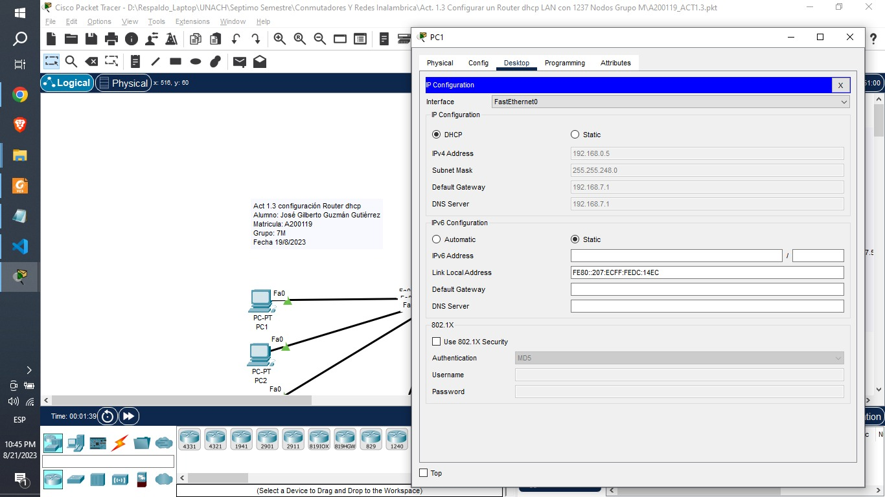

# Configuración de Cisco Packet Tracert

### 1. Activamos DHCP

Nota: Esto se debe de repetir con cada uno de los equipos.

### 2. Configuramos el router
    Router>ena
    Router#conf t
    Enter configuration commands, one per line.  End with CNTL/Z.
    Router(config)#interface f0/0
    Router(config-if)#ip add 192.168.7.1 255.255.248.0
    Router(config-if)#exit
    Router(config)#ip dhcp pool RED_LAN
    Router(dhcp-config)#default-router 192.168.7.1
    Router(dhcp-config)#dns-server 192.168.7.1
    Router(dhcp-config)#network 192.168.7.1 255.255.248.0
    Router(dhcp-config)#exit
    Router(config)#ip dhcp excluded-address 192.168.7.1 192.168.7.51
    Router(config)#exit
    Router#
    %SYS-5-CONFIG_I: Configured from console by console

    Router#wr
    Building configuration...
    [OK]
    Router#

# Carpeta de Github

https://github.com/Gilberto-Guzman/Conmutadores-Y-Redes-Inalambricas/tree/main/Act.%201.3%20Configurar%20un%20Router%20dhcp%20LAN%20con%201237%20Nodos%20Grupo%20M
