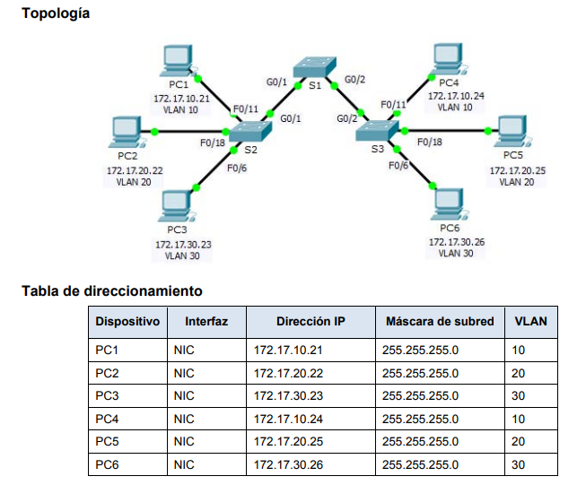

# Configuración de Redes de Vlans - Documento de Instrucciones

## Objetivo de la Actividad

El objetivo de esta actividad es que el alumno comprenda cómo administrar y configurar VLANs (Redes de Área Local Virtuales).

## Descripción

1. De forma individual, envía el PDF con la explicación de los equipos en la topología a utilizar.
2. Por cada equipo en la topología, realiza la comprobación de que se encuentre en la VLAN correspondiente.
3. Adjunta el archivo de configuración de Packet Tracer.
4. Comparte la URL de la carpeta de GitHub donde se encuentran los archivos.

**Notas:**
- Asegúrate de anexar la explicación de los equipos en formato PDF, detallando su ubicación en la topología.
- El archivo de configuración de Packet Tracer debe llevar tu matrícula como nombre.
