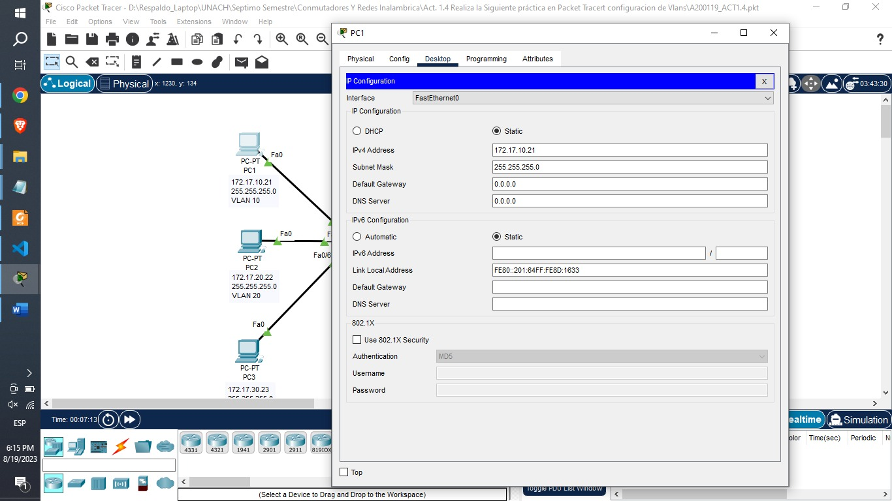
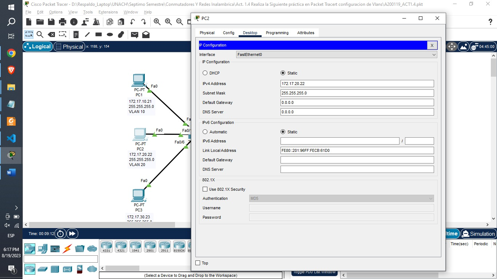
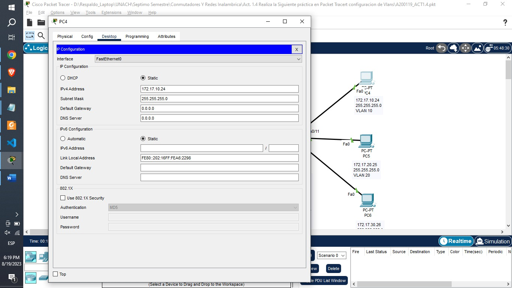
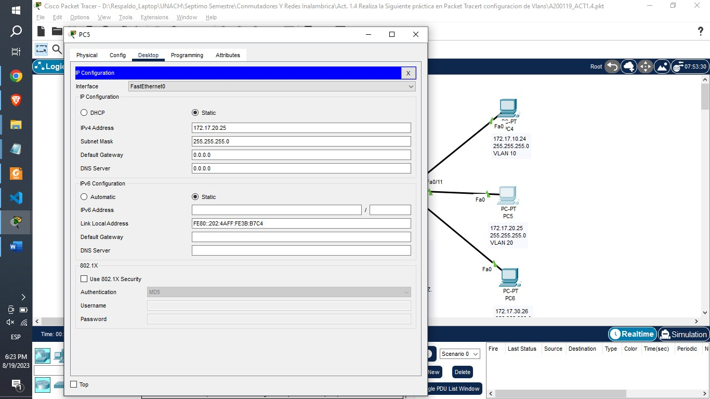
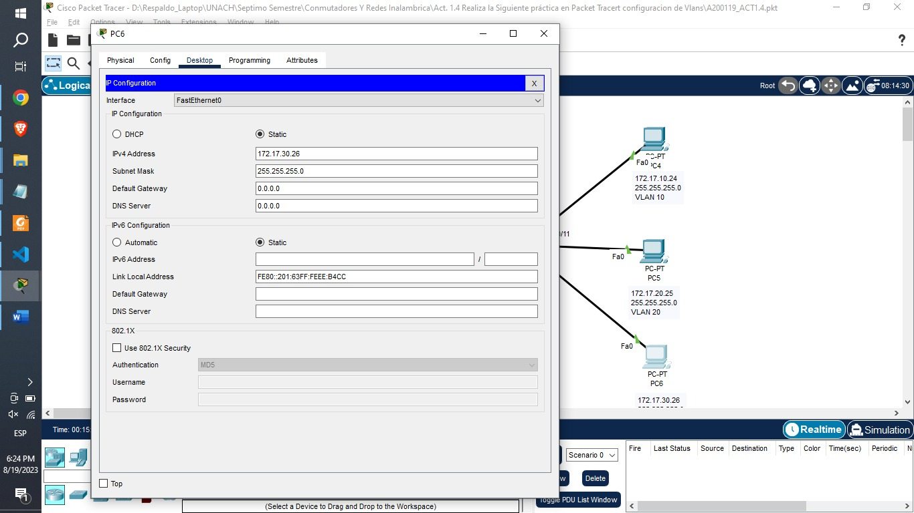
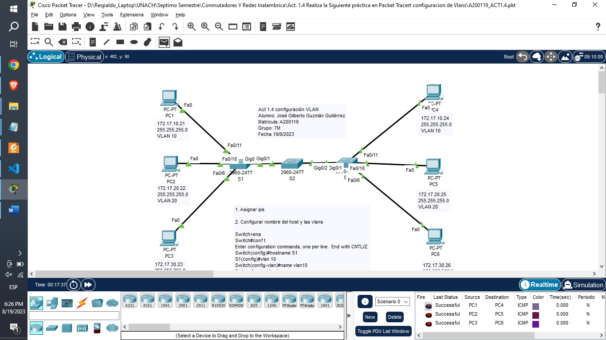

# Programación de la red

### 1. Asignación de IPs

### 2. Asignación del nombres

    Switch>ena
    Switch#conf t
    Enter configuration commands, one per line.  End with CNTL/Z.
    Switch(config)#hostname S1
    S1(config)#vlan 10
    Switch(config-vlan)#name vlan10
    S1(config-vlan)#exit
    S1(config)#vlan 20
    S1(config-vlan)#name vlan20
    S1(config-vlan)#exit
    S1(config)#vlan 30
    S1(config-vlan)#name vlan30
    S1(config-vlan)#exit
    S1(config)#

    Switch>ena
    Switch#conf t
    Enter configuration commands, one per line.  End with CNTL/Z.
    Switch(config)#hostname S2
    S2(config)#vlan 10
    S2(config-vlan)#name vlan10
    S2(config-vlan)#exit
    S2(config)#vlan 20
    S2(config-vlan)#name vlan20
    S2(config-vlan)#exit
    S2(config)#vlan 30
    S2(config-vlan)#name vlan30
    S2(config-vlan)#exit
    S2(config)#

    Switch>ena
    Switch#conf t
    Enter configuration commands, one per line.  End with CNTL/Z.
    Switch(config)#hostname S3
    S3(config)#vlan 10
    S3(config-vlan)#name vlan10
    S3(config-vlan)#exit
    S3(config)#vlan 20
    S3(config-vlan)#name vlan20
    S3(config-vlan)#exit
    S3(config)#vlan 30
    S3(config-vlan)#name vlan30
    S3(config-vlan)#exit
    S3(config)#

### 3. Asignación de puertos

    S1>ena
    S1#conf t
    Enter configuration commands, one per line.  End with CNTL/Z.
    S1(config)#inter f0/11
    S1(config-if)#switchport mode access
    S1(config-if)#switchport access vlan 10
    S1(config-if)#exit
    S1(config)#inter f0/18
    S1(config-if)#switchport mode access
    S1(config-if)#switchport access vlan 20
    S1(config-if)#exit
    S1(config)#inter f0/6
    S1(config-if)#switchport mode access
    S1(config-if)#switchport access vlan 30
    S1(config-if)#exit
    S1(config)#
    S1(config)#inter g 0/1
    S1(config-if)#switchport mode trunk

    S2>ena
    S2#conf t
    Enter configuration commands, one per line.  End with CNTL/Z.
    S2(config)#inter range gig0/1-2
    S2(config-if-range)#switchport mode trunk
    S2(config-if-range)#exit
    S2(config)#

    S3>ena
    S3#conf t
    Enter configuration commands, one per line.  End with CNTL/Z.
    S3(config)#inter f0/11
    S3(config-if)#switchport mode access
    S3(config-if)#switchport access vlan 10
    S3(config-if)#exit
    S3(config)#inter f0/18
    S3(config-if)#switchport mode access
    S3(config-if)#switchport access vlan 20
    S3(config-if)#exit
    S3(config)#inter f0/6
    S3(config-if)#switchport mode access
    S3(config-if)#switchport access vlan 30
    S3(config-if)#exit
    S3(config)#
    S3(config)#inter g0/1
    S3(config-if)#switchport mode trunk

# Comprobación de resultados

Se **permite la comunicación** entre los equipos que forman parte de la misma vlan.

Se **restringe la comunicación** entre los equipos que no forman parte de la misma vlan.
