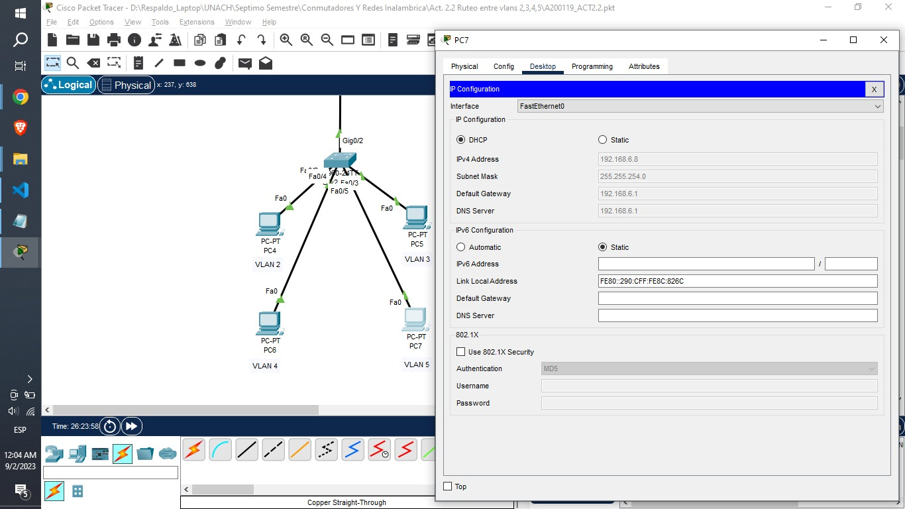
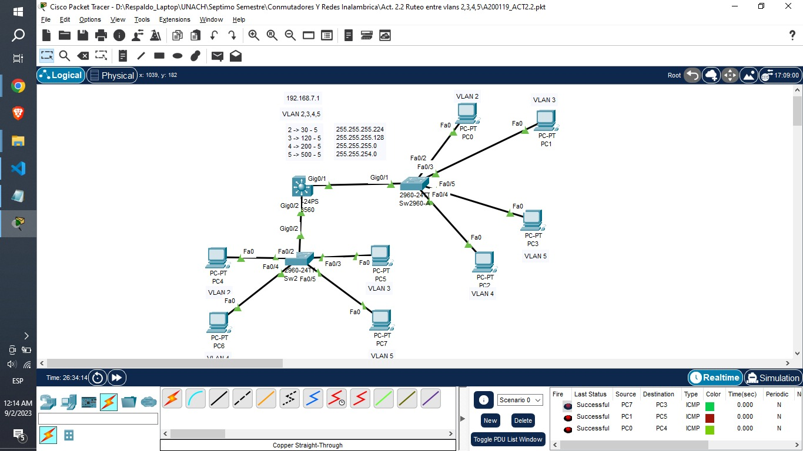
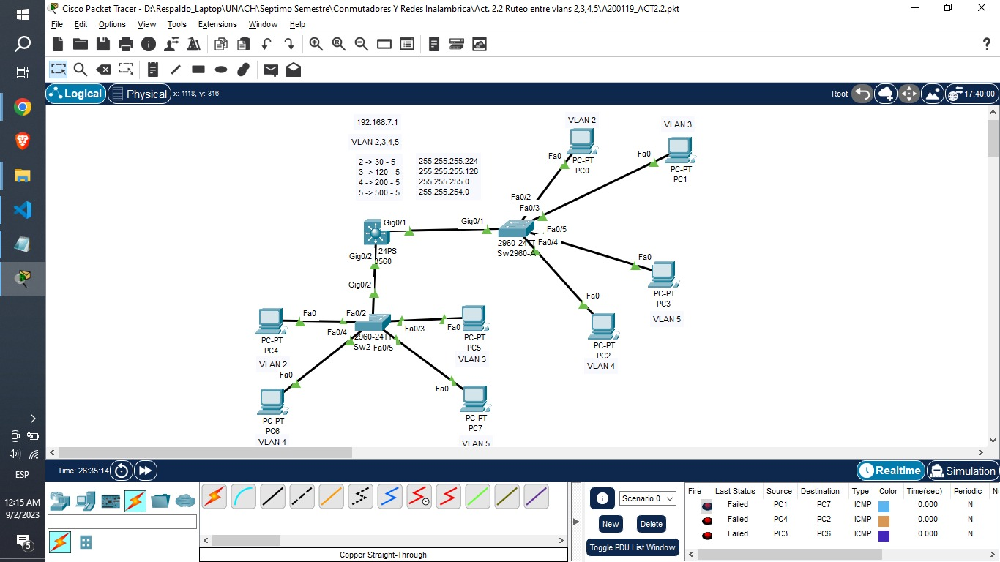

### 1. Activamos DHCP

Nota: Esto se debe de repetir con cada uno de los equipos.

### 2. Asignamos nombres

    Switch>
    Switch>ena
    Switch#conf t
    Switch(config)#hostname Sw3560
    Sw3560(config)#vlan 2
    Sw3560(config-vlan)#name vlan2
    Sw3560(config-vlan)#vlan 3
    Sw3560(config-vlan)#name vlan3
    Sw3560(config-vlan)#vlan 4
    Sw3560(config-vlan)#name vlan4
    Sw3560(config-vlan)#vlan 5
    Sw3560(config-vlan)#name vlan5
    Sw3560(config-vlan)#exit

### 3. Configuración del switch de capa 3

    Sw3560(config)#int range g0/1-2
    Sw3560(config-if-range)#switchport trunk encapsulation dot1q
    Sw3560(config-if-range)#switchport mode trunk
    Sw3560(config-if-range)#switchport trunk native vlan 1
    Sw3560(config-if-range)#exit
    Sw3560(config)#int f0/2
    Sw3560(config-if)#switchport mode access
    Sw3560(config-if)#switchport access vlan 2
    Sw3560(config-if)#exit
    Sw3560(config)#int fa0/3
    Sw3560(config-if)#switchport mode access
    Sw3560(config-if)#switchport access vlan 3
    Sw3560(config-if)#exit
    Sw3560(config)#int f0/4
    Sw3560(config-if)#switchport mode access
    Sw3560(config-if)#switchport access vlan 4
    Sw3560(config-if)#exit
    Sw3560(config)#int f0/5
    Sw3560(config-if)#switchport mode access
    Sw3560(config-if)#switchport access vlan 5
    Sw3560(config-if)#exit

    Sw3560(config)#int vlan 2
    Sw3560(config-if)#
    Sw3560(config-if)#ip add 192.168.2.1 255.255.255.224
    Sw3560(config-if)#exit
    Sw3560(config)#int vlan 3
    Sw3560(config-if)#
    Sw3560(config-if)#ip add 192.168.3.1 255.255.255.128
    Sw3560(config-if)#exit
    Sw3560(config)#int vlan 4
    Sw3560(config-if)#ip add 192.168.4.1 255.255.255.0
    Sw3560(config-if)#exit
    Sw3560(config)#int vlan 5
    Sw3560(config-if)#ip add 192.168.6.1 255.255.254.0
    Sw3560(config-if)#exit

    Sw3560(config)#ip dhcp excluded-address 192.168.2.1 192.168.2.6
    Sw3560(config)#ip dhcp excluded-address 192.168.3.1 192.168.3.6
    Sw3560(config)#ip dhcp excluded-address 192.168.4.1 192.168.4.6
    Sw3560(config)#ip dhcp excluded-address 192.168.6.1 192.168.6.6
    Sw3560(config)#ip dhcp pool 2
    Sw3560(dhcp-config)#network 192.168.2.0 255.255.255.224
    Sw3560(dhcp-config)#default-router 192.168.2.1
    Sw3560(dhcp-config)#dns-server 192.168.2.1
    Sw3560(dhcp-config)#exit
    Sw3560(config)#ip dhcp pool 3
    Sw3560(dhcp-config)#network 192.168.3.0 255.255.255.128
    Sw3560(dhcp-config)#default-router 192.168.3.1
    Sw3560(dhcp-config)#dns-server 192.168.3.1
    Sw3560(dhcp-config)#exit
    Sw3560(config)#ip dhcp pool 4
    Sw3560(dhcp-config)#network 192.168.4.0 255.255.255.0
    Sw3560(dhcp-config)#default-router 192.168.4.1
    Sw3560(dhcp-config)#dns-server 192.168.4.1
    Sw3560(dhcp-config)#exit
    Sw3560(config)#ip dhcp pool 5
    Sw3560(dhcp-config)#network 192.168.6.0 255.255.254.0
    Sw3560(dhcp-config)#default-router 192.168.6.1
    Sw3560(dhcp-config)#dns-server 192.168.6.1
    Sw3560(dhcp-config)#

### 4. Configuración de ambos Switches de capa 2

    Switch>ena
    Switch#conf t
    Switch(config)#hostname Sw2960-A
    Sw2960-A(config)#int g0/1
    Sw2960-A(config-if)#switchport mode trunk
    Sw2960-A(config-if)#switchport trunk native vlan 1
    Sw2960-A(config-if)#exit
    Sw2960-A(config)#int f0/2
    Sw2960-A(config-if)#switchport mode access
    Sw2960-A(config-if)#switchport access vlan 2
    Sw2960-A(config-if)#exit
    Sw2960-A(config)#int f0/3
    Sw2960-A(config-if)#switchport mode access
    Sw2960-A(config-if)#switchport access vlan 3
    Sw2960-A(config-if)#exit
    Sw2960-A(config)#int f0/4
    Sw2960-A(config-if)#switchport mode access
    Sw2960-A(config-if)#switchport access vlan 4
    Sw2960-A(config-if)#exit
    Sw2960-A(config)#int f0/5
    Sw2960-A(config-if)#switchport mode access
    Sw2960-A(config-if)#switchport access vlan 5
    Sw2960-A(config-if)#exit
    Sw2960-A(config)#

    Switch>ena
    Switch#conf t
    Enter configuration commands, one per line.  End with CNTL/Z.
    Switch(config)#hostname Sw2960-B
    Sw2960-B(config)#int g0/2
    Sw2960-B(config-if)#switchport mode trunk
    Sw2960-B(config-if)#switchport trunk native vlan 1
    Sw2960-B(config-if)#exit
    Sw2960-B(config)#int f0/2
    Sw2960-B(config-if)#switchport mode access
    Sw2960-B(config-if)#switchport access vlan 2
    Sw2960-B(config-if)#exit
    Sw2960-B(config)#int f0/3
    Sw2960-B(config-if)#switchport mode access
    Sw2960-B(config-if)#switchport access vlan 3
    Sw2960-B(config-if)#exit
    Sw2960-B(config)#int f0/4
    Sw2960-B(config-if)#switchport mode access
    Sw2960-B(config-if)#switchport access vlan 4
    Sw2960-B(config-if)#exit
    Sw2960-B(config)#int f0/5
    Sw2960-B(config-if)#switchport mode access
    Sw2960-B(config-if)#switchport access vlan 5
    Sw2960-B(config-if)#exit
    Sw2960-B(config)#

## 4. Comprobación de resultados

Se **permite la comunicación** entre los equipos que forman parte de la misma vlan.

Se **restringe la comunicación** entre los equipos que no forman parte de la misma vlan.

# Carpeta de Github

aaa