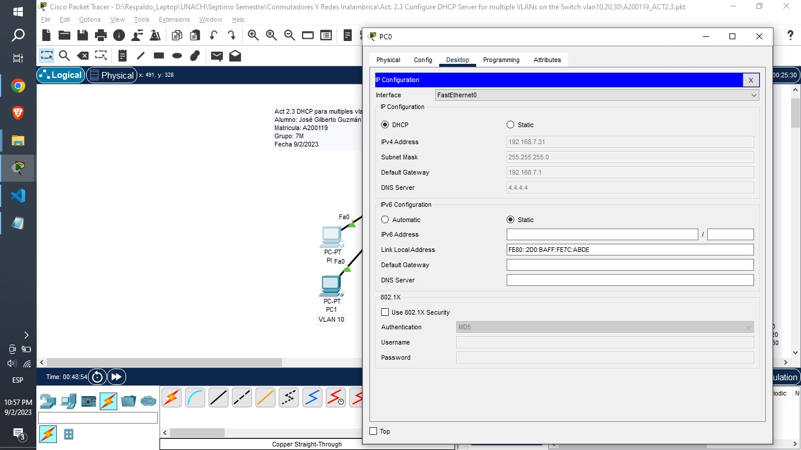
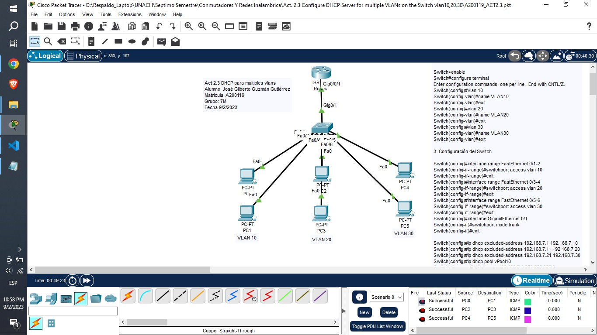
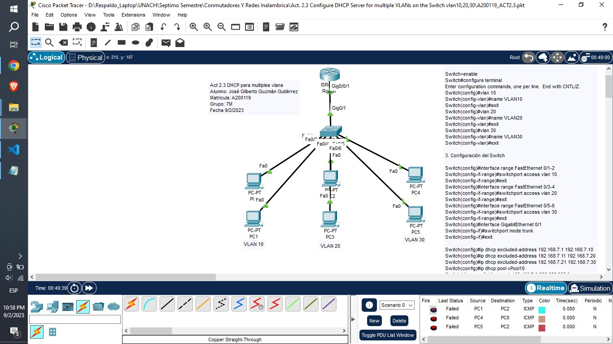

### 1. Activamos DHCP

Nota: Esto se debe de repetir con cada uno de los equipos.

### 2. Asignamos nombres

Switch>enable
Switch#configure terminal
Enter configuration commands, one per line.  End with CNTL/Z.
Switch(config)#vlan 10
Switch(config-vlan)#name VLAN10
Switch(config-vlan)#exit
Switch(config)#vlan 20
Switch(config-vlan)#name VLAN20
Switch(config-vlan)#exit
Switch(config)#vlan 30
Switch(config-vlan)#name VLAN30
Switch(config-vlan)#exit

### 3. Configuración del Switch

Switch(config)#interface range FastEthernet 0/1-2
Switch(config-if-range)#switchport access vlan 10
Switch(config-if-range)#exit
Switch(config)#interface range FastEthernet 0/3-4
Switch(config-if-range)#switchport access vlan 20
Switch(config-if-range)#exit
Switch(config)#interface range FastEthernet 0/5-6
Switch(config-if-range)#switchport access vlan 30
Switch(config-if-range)#exit
Switch(config)#interface GigabitEthernet 0/1
Switch(config-if)#switchport mode trunk
Switch(config-if)#exit

Switch(config)#ip dhcp excluded-address 192.168.7.1 192.168.7.10
Switch(config)#ip dhcp excluded-address 192.168.7.11 192.168.7.20
Switch(config)#ip dhcp excluded-address 192.168.7.21 192.168.7.30
Switch(config)#ip dhcp pool vPool10
Switch(dhcp-config)#network 192.168.7.0 255.255.255.0
Switch(dhcp-config)#default-router 192.168.7.1
Switch(dhcp-config)#dns-server 4.4.4.4
Switch(dhcp-config)#exit
Switch(config)#ip dhcp pool vPool20
Switch(dhcp-config)#network 192.168.7.0 255.255.255.0
Switch(dhcp-config)#default-router 192.168.7.1
Switch(dhcp-config)#dns-server 8.8.8.8
Switch(dhcp-config)#exit
Switch(config)#ip dhcp pool vPool30
Switch(dhcp-config)#network 192.168.7.0 255.255.255.0
Switch(dhcp-config)#default-router 192.168.7.1
Switch(dhcp-config)#dns-server 30.0.0.2
Switch(dhcp-config)#exit
Switch(config)#interface vlan 10
Switch(config-if)#ip address 192.168.7.5 255.255.255.0
Switch(config-if)#exit	
Switch(config)#interface vlan 20
Switch(config-if)#ip address 192.168.7.6 255.255.255.0
Switch(config-if)#exit
Switch(config)#interface vlan 30
Switch(config-if)#ip address 192.168.7.7 255.255.255.0
Switch(config-if)#exit
Switch(config)#

### 4. Configuración del Router

Router>enable
Router#configure terminal
Enter configuration commands, one per line.  End with CNTL/Z.
Router(config)#interface GigabitEthernet 0/0/1
Router(config-if)#no ip address
Router(config-if)#no shutdown
Router(config-if)#exit
Router(config)#interface GigabitEthernet 0/0/1.10
Router(config-subif)#encapsulation dot1Q 10
Router(config-subif)#ip address 192.168.7.1 255.255.255.0
Router(config-subif)#exit
Router(config)#interface GigabitEthernet 0/0/1.20
Router(config-subif)#encapsulation dot1Q 20
Router(config-subif)#ip address 192.168.8.1 255.255.255.0
Router(config-subif)#exit
Router(config)#interface GigabitEthernet0/0/1.30
Router(config-subif)#encapsulation dot1Q 30
Router(config-subif)#ip address 192.168.9.1 255.255.255.0
Router(config-subif)#

## 5. Comprobación de resultados

Se **permite la comunicación** entre los equipos que forman parte de la misma vlan.

Se **restringe la comunicación** entre los equipos que no forman parte de la misma vlan.

# Carpeta de Github

aaa