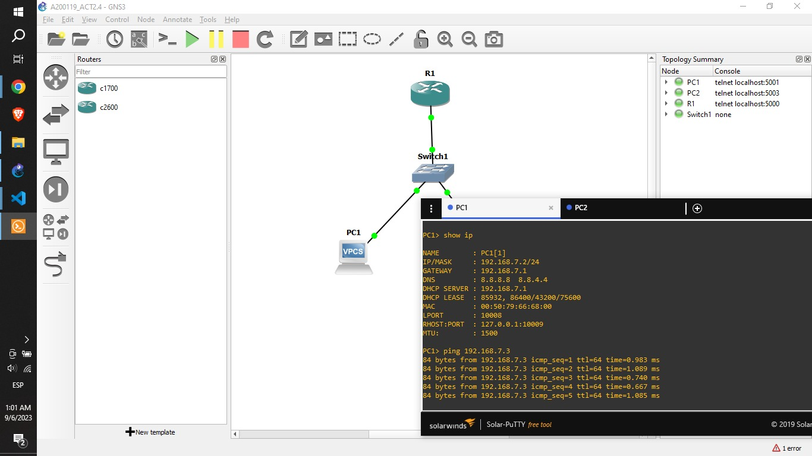
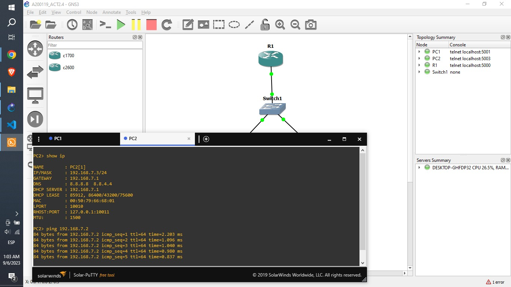

# 1. Configuración del router

    R1#configure terminal
    R1(config)#interface ethernet 0/0
    R1(config-if)#ip address 192.168.7.1 255.255.255.0
    R1(config-if)#exit
    R1(config)#
    R1(config)#service dhcp
    R1(config)#ip dhcp pool GIL
    R1(dhcp-config)#network 192.168.7.0 255.255.255.0
    R1(dhcp-config)#default-router 192.168.7.1

# 2. Activación del enlace DHCP en ambas PCs

    PC1> ip dhcp
    DORA IP 192.168.7.2/24 GW 192.168.7.1

    PC2> ip dhcp
    DORA IP 192.168.7.3/24 GW 192.168.7.1

# 3. Comprobación de resultados

    PC1> show ip

    NAME : PC1[1]
    IP/MASK : 192.168.7.2/24
    GATEWAY : 192.168.7.1
    DNS : 8.8.8.8 8.8.4.4
    DHCP SERVER : 192.168.7.1
    DHCP LEASE : 86243, 86400/43200/75600
    MAC : 00:50:79:66:68:00
    LPORT : 10008
    RHOST:PORT : 127.0.0.1:10009
    MTU: : 1500

    PC1> ping 192.168.7.3
    84 bytes from 192.168.7.3 icmp_seq=1 ttl=64 time=0.903 ms
    84 bytes from 192.168.7.3 icmp_seq=2 ttl=64 time=0.879 ms
    84 bytes from 192.168.7.3 icmp_seq=3 ttl=64 time=0.998 ms
    84 bytes from 192.168.7.3 icmp_seq=4 ttl=64 time=0.596 ms
    84 bytes from 192.168.7.3 icmp_seq=5 ttl=64 time=1.058 ms

Se **permite la comunicación** entre ambos equipos.

    PC2> show ip

    NAME : PC2[1]
    IP/MASK : 192.168.7.3/24
    GATEWAY : 192.168.7.1
    DNS : 8.8.8.8 8.8.4.4
    DHCP SERVER : 192.168.7.1
    DHCP LEASE : 86303, 86400/43200/75600
    MAC : 00:50:79:66:68:01
    LPORT : 10010
    RHOST:PORT : 127.0.0.1:10011
    MTU: : 1500

    PC2> ping 192.168.7.2
    84 bytes from 192.168.7.2 icmp_seq=1 ttl=64 time=0.958 ms
    84 bytes from 192.168.7.2 icmp_seq=2 ttl=64 time=1.134 ms
    84 bytes from 192.168.7.2 icmp_seq=3 ttl=64 time=1.232 ms
    84 bytes from 192.168.7.2 icmp_seq=4 ttl=64 time=0.539 ms
    84 bytes from 192.168.7.2 icmp_seq=5 ttl=64 time=0.787 ms

Se **permite la comunicación** entre ambos equipos.

# Carpeta de Github

aaa
