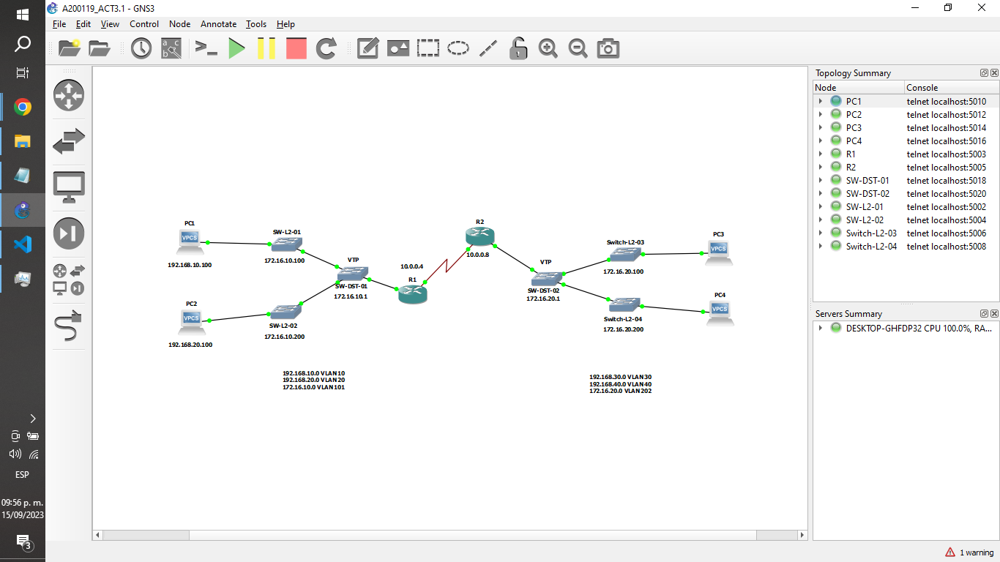

# Act. 3.1 Configura un VTP con vlans en Gns3.

## Topologia.

## Código.

### SW-L2-01

    SW-L2-01>enable
    SW-L2-01#configure terminal
    Enter configuration commands, one per line. End with CNTL/Z.
    SW-L2-01(config)#vtp domain cisco-01
    Changing VTP domain name from CISCO-vIOS to cisco-01
    SW-L2-01(config)#
    \*Sep 15 21:27:16.669: %SW_VLAN-6-VTP_DOMAIN_NAME_CHG: VTP domain name changed to cisco-01.
    SW-L2-01(config)#vtp mode ?
    client Set the device to client mode.
    off Set the device to off mode.
    server Set the device to server mode.
    transparent Set the device to transparent mode.
    SW-L2-01(config)#vtp mode client
    Setting device to VTP Client mode for VLANS.
    SW-L2-01(config)#vtp password cisco
    Setting device VTP password to cisco
    SW-L2-01(config)#exit
    SW-L2-01#wr
    Building configuration...
    Compressed configuration from 5090 bytes to 1915 bytes[OK]
    SW-L2-01#

### SW-L2-02

    SW-L2-02>enable
    SW-L2-02#configure terminal
    Enter configuration commands, one per line.  End with CNTL/Z.
    SW-L2-02(config)#vtp domain cisco-01
    Changing VTP domain name from CISCO-vIOS to cisco-01
    SW-L2-02(config)#
    *Sep 15 21:32:14.701: %SW_VLAN-6-VTP_DOMAIN_NAME_CHG: VTP domain name changed to cisco-02.
    SW-L2-02(config)#vtp mode client
    Setting device to VTP Client mode for VLANS.
    SW-L2-02(config)#vtp password cisco
    Setting device VTP password to cisco
    SW-L2-02(config)#exit
    *Sep 15 21:33:25.243: %SYS-5-CONFIG_I: Configured from console by console
    SW-L2-02#wr
    Building configuration...
    Compressed configuration from 5090 bytes to 1915 bytes[OK]
    SW-L2-02#

### SW-DST-01

    SW-DST-01>enable
    SW-DST-01#configure terminal
    Enter configuration commands, one per line.  End with CNTL/Z.
    SW-DST-01(config)#vtp domain cisco-01
    Changing VTP domain name from CISCO-vIOS to cisco-01
    SW-DST-01(config)#vtp
    *Sep 15 21:39:38.559: %SW_VLAN-6-VTP_DOMAIN_NAME_CHG: VTP domain name changed to cisco-01.
    SW-DST-01(config)#vtp mode server
    Setting device to VTP Server mode for VLANS.
    SW-DST-01(config)#
    *Sep 15 21:39:46.001: %SW_VLAN-4-VTP_USER_NOTIFICATION: VTP protocol user notification: MD5 digest checksum mismatch on rec
    SW-DST-01(config)#
    *Sep 15 21:39:48.043: %SW_VLAN-4-VTP_USER_NOTIFICATION: VTP protocol user notification: MD5 digest checksum mismatch on rec
    SW-DST-01(config)#vtp password cisco
    Setting device VTP password to cisco
    SW-DST-01(config)#exit
    SW-DST-01#wr
    Building configuration...
    Compressed configuration from 5089 bytes to 1919 bytes[OK]
    *Sep 15 21:39:53.807: %SYS-5-CONFIG_I: Configured from console by console
    *Sep 15 21:39:58.839: %GRUB-5-CONFIG_WRITING: GRUB configuration is being updated on disk. Please wait...
    SW-DST-01#

### SW-L2-03

    SW-L2-03>
    SW-L2-03>enable
    SW-L2-03#configure terminal
    Enter configuration commands, one per line.  End with CNTL/Z.
    SW-L2-03(config)#vtp domain cisco-02
    Changing VTP domain name from CISCO-vIOS to cisco-02
    SW-L2-03(config)#vtp mode client
    Setting device to VTP Client mode for VLANS.
    SW-L2-03(config)#
    *Sep 15 21:41:52.990: %SW_VLAN-6-VTP_DOMAIN_NAME_CHG: VTP domain name changed to cisco-02.
    SW-L2-03(config)#vtp password cisco
    Setting device VTP password to cisco
    SW-L2-03(config)#
    *Sep 15 21:42:12.723: %DTP-5-DOMAINMISMATCH: Unable to perform trunk negotiation on port Gi0/1 because of VTP domain mismat.
    SW-L2-03(config)#exit
    SW-L2-03#wr
    Building configuration...
    Compressed configuration from 5088 bytes to 1919 bytes
    *Sep 15 21:42:24.237: %SYS-5-CONFIG_I: Configured from console by console[OK]

### SW-L2-04

    SW-L2-04>enable
    SW-L2-04#configure terminal
    Enter configuration commands, one per line.  End with CNTL/Z.
    SW-L2-04(config)#vtp domain cisco-02
    Changing VTP domain name from CISCO-vIOS to cisco-02
    SW-L2-04(config)#vtp mode client
    *Sep 15 21:44:30.793: %SW_VLAN-6-VTP_DOMAIN_NAME_CHG: VTP domain name changed to cisco-02.
    SW-L2-04(config)#vtp mode client
    Setting device to VTP Client mode for VLANS.
    SW-L2-04(config)#vtp password cisco
    Setting device VTP password to cisco
    SW-L2-04(config)#exit
    SW-L2-04#wr
    Building configuration...
    Compressed configuration from 5088 bytes to 1917 bytes[OK]
    *Sep 15 21:44:38.996: %SYS-5-CONFIG_I: Configured from console by console
    *Sep 15 21:44:45.542: %GRUB-5-CONFIG_WRITING: GRUB configuration is being updated on disk. Please wait...

### SW-DST-02

    SW-DST-02>
    SW-DST-02>enable
    SW-DST-02#configure terminal
    Enter configuration commands, one per line.  End with CNTL/Z.
    SW-DST-02(config)#vtp domain cisco-02
    Changing VTP domain name from CISCO-vIOS to cisco-02
    SW-DST-02(config)#vtp mode server
    *Sep 15 21:46:39.356: %SW_VLAN-6-VTP_DOMAIN_NAME_CHG: VTP domain name changed to cisco-02.
    SW-DST-02(config)#vtp mode server
    Setting device to VTP Server mode for VLANS.
    SW-DST-02(config)#vtp password cisco
    Setting device VTP password to cisco
    SW-DST-02(config)#exit
    SW-DST-02#wr
    Building configuration...
    Compressed configuration from 5089 bytes to 1917 bytes
    *Sep 15 21:47:14.955: %SYS-5-CONFIG_I: Configured from console by console[OK]

### Repositorio de Github.

https://github.com/Gilberto-Guzman/Conmutadores-Y-Redes-Inalambricas/tree/main/Act.%203.1%20Configura%20un%20VTP%20con%20vlans%20en%20Gns3
