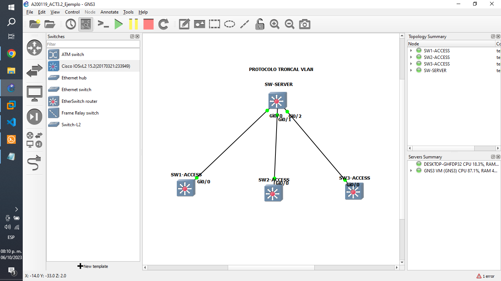
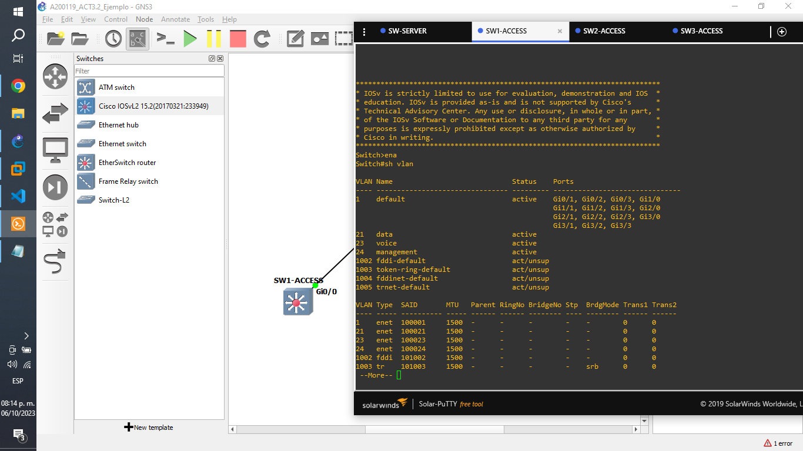
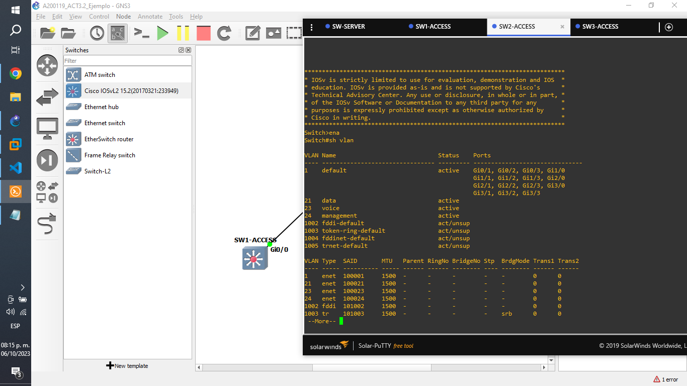
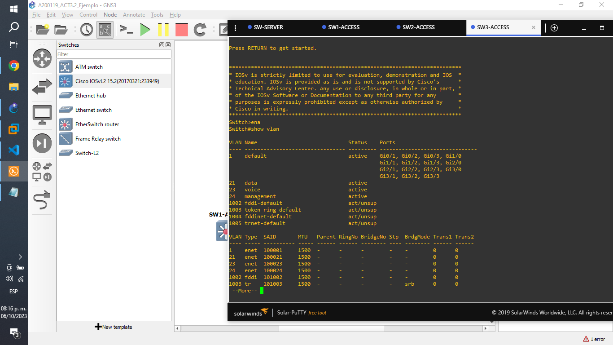

# 3. Configura y verifica un VTP en GNS3 un ejemplo (anexar el url de github).

## Topología.

### SW-SERVER.

    Switch>ena
    Switch#conf t
    Enter configuration commands, one per line.  End with CNTL/Z.
    Switch(config)#int range gi0/0-2
    Switch(config-if-range)#switchport trunk encapsulation dot1q
    Switch(config-if-range)#switchport mode trunk
    Switch(config-if-range)#exit
    Switch(config)#vtp mode server
    Device mode already VTP Server for VLANS.
    Switch(config)#vtp domain gilberto
    Changing VTP domain name from NULL to gilberto
    Switch(config)#
    *Oct  6 20:31:57.441: %SW_VLAN-6-VTP_DOMAIN_NAME_CHG: VTP domain name changed to gilberto.
    Switch(config)#vtp password cisco
    Setting device VTP password to cisco
    Switch(config)#vlan 21
    Switch(config-vlan)#name data
    Switch(config-vlan)#vlan 23
    Switch(config-vlan)#name voice
    Switch(config-vlan)#end
    Switch#wr

### SW1-ACCESS.

    Switch>
    Switch>ena
    Switch#conf t
    Enter configuration commands, one per line.  End with CNTL/Z.
    Switch(config)#int gi0/0
    Switch(config-if)#switchport trunk encapsulation dot1q
    Switch(config-if)#switchport mode trunk
    Switch(config-if)#exit
    Switch(config)#vtp mode client
    Setting device to VTP Client mode for VLANS.
    Switch(config)#vtp domain gilberto
    Changing VTP domain name from NULL to gilberto
    Switch(config)#
    *Oct  6 20:47:25.456: %SW_VLAN-6-VTP_DOMAIN_NAME_CHG: VTP domain name changed to gilberto.
    Switch(config)#vtp password cisco
    Setting device VTP password to cisco
    Switch(config)#end
    Switch#
    *Oct  6 20:47:46.331: %SYS-5-CONFIG_I: Configured from console by console
    Switch#wr

### SW2-ACCESS.

    Switch>ena
    Switch#conf t
    Enter configuration commands, one per line.  End with CNTL/Z.
    Switch(config)#int gi0/0
    Switch(config-if)#switchport trunk encapsulation dot1q
    Switch(config-if)#switchport mode trunk
    Switch(config-if)#exit
    Switch(config)#vtp mode client
    Setting device to VTP Client mode for VLANS.
    Switch(config)#vtp domain gilberto
    Changing VTP domain name from NULL to gilberto
    Switch(config)#vtp password cisco
    Setting device VTP password to cisco
    Switch(config)#end
    Switch#
    *Oct  6 21:04:41.231: %SYS-5-CONFIG_I: Configured from console by console
    Switch#wr

### SW3-ACCESS.

    Switch>
    Switch>ena
    Switch#conf t
    Enter configuration commands, one per line.  End with CNTL/Z.
    Switch(config)#int gi0/0
    Switch(config-if)#switchport trunk encapsulation dot1q
    Switch(config-if)#switchport mode trunk
    Switch(config-if)#exit
    Switch(config)#vtp mode client
    Setting device to VTP Client mode for VLANS.
    Switch(config)#vtp domain gilberto
    Changing VTP domain name from NULL to gilberto
    Switch(config)#
    *Oct  7 01:22:53.748: %SW_VLAN-6-VTP_DOMAIN_NAME_CHG: VTP domain name changed to gilberto.
    Switch(config)#vtp password cisco
    Setting device VTP password to cisco
    Switch(config)#end
    Switch#
    *Oct  7 01:23:08.030: %SYS-5-CONFIG_I: Configured from console by console
    Switch#wr

### SW-SERVER.

Ahora para comprobar su funcionamiento, agregaremos una nueva Vlan llamada management:

    Switch>
    Switch>ena
    Switch#conf t
    Enter configuration commands, one per line.  End with CNTL/Z.
    Switch(config)#vlan 24
    Switch(config-vlan)#name management
    Switch(config-vlan)#end
    Switch#wr
    Building configuration...

    *Oct  7 01:54:10.308: %SYS-5-CONFIG_I: Configured from console by consoleCompressed configuration from 3691 bytes to 1660 bytes[OK]
    *Oct  7 01:54:16.508: %GRUB-5-CONFIG_WRITING: GRUB configuration is being updated on disk. Please wait...
    *Oct  7 01:54:17.433: %GRUB-5-CONFIG_WRITTEN: GRUB configuration was written to disk successfully.
    Switch#

y la visualizamos desde cualquier Switch de acceso:

