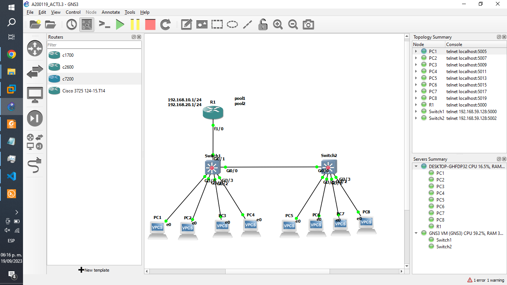

# Act. 3.3 Configurar un Router con GNS3 con DHCP con 2 segmentos VLANS VTP.

## Topologia.

### Switch 1 VTP SERVER.

    Switch>
    Switch>
    Switch>ena
    Switch#conf t
    Enter configuration commands, one per line.  End with CNTL/Z.
    Switch(config)#vlan 10
    Switch(config-vlan)#name VLAN 10
    Switch(config-vlan)#exit
    Switch(config)#vlan 20
    Switch(config-vlan)#name VLAN 20
    Switch(config-vlan)#exit
    Switch(config)#vtp mode server
    Device mode already VTP Server for VLANS.
    Switch(config)#vtp domain cisco-1
    Changing VTP domain name from NULL to cisco-1
    Switch(config)#
    *Sep 19 22:39:20.339: %SW_VLAN-6-VTP_DOMAIN_NAME_CHG: VTP domain name changed to cisco-1.
    Switch(config)#
    Switch(config)#vtp password cisco
    Setting device VTP password to cisco
    Switch(config)#interface g0/1
    Switch(config-if)#switchport trunk encapsulation dot1q
    Switch(config-if)#switchport mode trunk
    Switch(config-if)#no shutdown
    Switch(config-if)#exit
    Switch(config)#interface g0/0
    Switch(config-if)#switchport trunk encapsulation dot1q
    Switch(config-if)#switchport mode trunk
    Switch(config-if)#no shutdown
    Switch(config-if)#exit
    Switch(config)#do wr
    Building configuration...
    Compressed configuration from 3624 bytes to 1629 bytes[OK]
    Switch(config)#
    *Sep 19 22:43:50.619: %GRUB-5-CONFIG_WRITING: GRUB configuration is being updated on disk. Please wait...
    *Sep 19 22:43:51.389: %GRUB-5-CONFIG_WRITTEN: GRUB configuration was written to disk successfully.
    Switch(config)#

### Switch 2 VTP CLIENT.

    Switch>ena
    Switch#conf t
    Enter configuration commands, one per line.  End with CNTL/Z.
    Switch(config)#vtp mode client
    Setting device to VTP Client mode for VLANS.
    Switch(config)#vtp domain cisco-1
    Changing VTP domain name from NULL to cisco-1
    Switch(config)#
    *Sep 19 22:50:00.651: %SW_VLAN-6-VTP_DOMAIN_NAME_CHG: VTP domain name changed to cisco-1.
    Switch(config)#vtp password cisco
    Setting device VTP password to cisco
    Switch(config)#

### Switch 1 INTERFACES VLAN.

    Switch>ena
    Switch#conf t
    Enter configuration commands, one per line.  End with CNTL/Z.
    Switch(config)#interface range g3/0 - 3
    Switch(config-if-range)#switchport access vlan 10
    Switch(config-if-range)#exit
    Switch(config)#do wr
    Building configuration...
    Compressed configuration from 3732 bytes to 1679 bytes[OK]
    Switch(config)#
    Switch(config)#
    *Sep 19 22:57:25.515: %GRUB-5-CONFIG_WRITING: GRUB configuration is being updated on disk. Please wait...
    *Sep 19 22:57:26.372: %GRUB-5-CONFIG_WRITTEN: GRUB configuration was written to disk successfully.
    Switch(config)#

### Switch 2 INTERFACES VLAN.

    Switch>ena
    Switch#conf t
    Enter configuration commands, one per line.  End with CNTL/Z.
    Switch(config)#interface range g3/0 - 3
    Switch(config-if-range)#switchport access vlan 20
    Switch(config-if-range)#exit
    Switch(config)#do wr
    Building configuration...
    Compressed configuration from 3610 bytes to 1613 bytes[OK]
    Switch(config)#
    *Sep 19 23:02:10.145: %GRUB-5-CONFIG_WRITING: GRUB configuration is being updated on disk. Please wait...
    *Sep 19 23:02:11.003: %GRUB-5-CONFIG_WRITTEN: GRUB configuration was written to disk successfully.
    Switch(config)#

### Switch 1 REVISAMOS SU CONFIGURACION.

    Switch>ena
    Switch#show vtp status
    VTP Version capable             : 1 to 3
    VTP version running             : 1
    VTP Domain Name                 : cisco-1
    VTP Pruning Mode                : Disabled
    VTP Traps Generation            : Disabled
    Device ID                       : 0c3f.f436.8000
    Configuration last modified by 0.0.0.0 at 9-19-23 22:38:55
    Local updater ID is 0.0.0.0 (no valid interface found)

    Feature VLAN:
    --------------
    VTP Operating Mode                : Server
    Maximum VLANs supported locally   : 1005
    Number of existing VLANs          : 7
    Configuration Revision            : 2
    MD5 digest                        : 0x0C 0xC5 0x68 0xC4 0xBD 0x4F 0x08 0x98
                                        0x51 0x0E 0x56 0x86 0x26 0xBD 0x82 0x57
    Switch#

### Switch 2 REVISAMOS SU CONFIGURACION.

    Switch>
    Switch>ena
    Switch#show vtp status
    VTP Version capable             : 1 to 3
    VTP version running             : 1
    VTP Domain Name                 : cisco-1
    VTP Pruning Mode                : Disabled
    VTP Traps Generation            : Disabled
    Device ID                       : 0c80.e4ff.8000
    Configuration last modified by 0.0.0.0 at 9-19-23 22:38:55

    Feature VLAN:
    --------------
    VTP Operating Mode                : Client
    Maximum VLANs supported locally   : 1005
    Number of existing VLANs          : 7
    Configuration Revision            : 2
    MD5 digest                        : 0x0C 0xC5 0x68 0xC4 0xBD 0x4F 0x08 0x98
                                        0x51 0x0E 0x56 0x86 0x26 0xBD 0x82 0x57
    Switch#

### Router SUBINTERFACES VLANS 10 Y 20.

    R1#conf t
    Enter configuration commands, one per line.  End with CNTL/Z.
    R1(config)#interface f1/0.10
    R1(config-subif)#encapsulation dot1q 10
    R1(config-subif)#ip address 192.168.10.1 255.255.255.0
    R1(config-subif)#exit
    R1(config)#interface f1/0.20
    R1(config-subif)#encapsulation dot1q 20
    R1(config-subif)#ip address 192.168.20.1 255.255.255.0
    R1(config-subif)#exit
    R1(config)#interface f1/0
    R1(config-if)#no shutdown
    R1(config-if)#exit
    R1(config)#
    *Sep 19 17:48:14.547: %LINK-3-UPDOWN: Interface FastEthernet1/0, changed state to up
    *Sep 19 17:48:15.547: %LINEPROTO-5-UPDOWN: Line protocol on Interface FastEthernet1/0, changed state to up
    R1(config)#do wr
    Warning: Attempting to overwrite an NVRAM configuration previously written
    by a different version of the system image.
    Overwrite the previous NVRAM configuration?[confirm]
    Building configuration...
    [OK]
    R1(config)#

### Router POOLS CISCO1 Y CISCO2.

    R1#
    *Sep 19 17:48:34.107: %SYS-5-CONFIG_I: Configured from console by console
    R1#conf t
    Enter configuration commands, one per line.  End with CNTL/Z.
    R1(config)#ip dhcp pool cisco1
    R1(dhcp-config)#network 192.168.10.0 255.255.255.0
    R1(dhcp-config)#dns-server 8.8.8.8
    R1(dhcp-config)#exit
    R1(config)#ip dhcp pool cisco2
    R1(dhcp-config)#network 192.168.20.0 255.255.255.0
    R1(dhcp-config)#dns-server 8.8.8.8
    R1(dhcp-config)#exit
    R1(config)#do wr
    Building configuration...
    [OK]
    R1(config)#

### Router RIP.

    R1#conf t
    Enter configuration commands, one per line.  End with CNTL/Z.
    R1(config)#router rip
    R1(config-router)#version 2
    R1(config-router)#no auto-summary
    R1(config-router)#network 192.168.10.0
    R1(config-router)#network 192.168.20.0
    R1(config-router)#exit
    R1(config)#do wr
    Building configuration...
    [OK]

### DHCP.

    PC1> dhcp
    DDORA IP 192.168.10.2/24 GW 192.168.10.1
    PC1> ping 192.168.20.2
    192.168.20.2 icmp_seq=1 timeout
    192.168.20.2 icmp_seq=2 timeout
    84 bytes from 192.168.20.2 icmp_seq=3 ttl=63 time=32.212 ms
    84 bytes from 192.168.20.2 icmp_seq=4 ttl=63 time=32.281 ms
    84 bytes from 192.168.20.2 icmp_seq=5 ttl=63 time=32.114 ms

    PC8> dhcp
    DDORA IP 192.168.20.2/24 GW 192.168.20.1
    PC8> ping 192.168.10.2
    192.168.10.2 icmp_seq=1 timeout
    192.168.10.2 icmp_seq=2 timeout
    84 bytes from 192.168.10.2 icmp_seq=3 ttl=63 time=32.212 ms
    84 bytes from 192.168.10.2 icmp_seq=4 ttl=63 time=32.281 ms
    84 bytes from 192.168.10.2 icmp_seq=5 ttl=63 time=32.114 ms

### Repositorio de Github

    https://github.com/Gilberto-Guzman/Conmutadores-Y-Redes-Inalambricas/tree/main/Act.%203.3%20Configurar%20un%20Router%20con%20GNS3%20con%20DHCP%20con%202%20segmentos%20VLANS%20VTP
