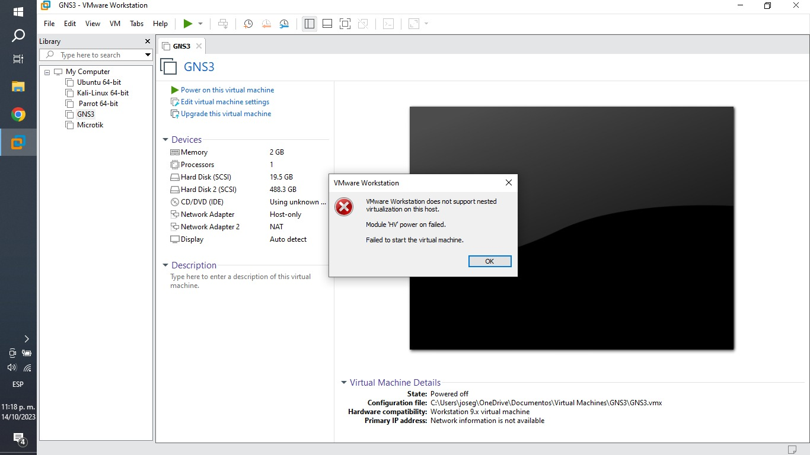
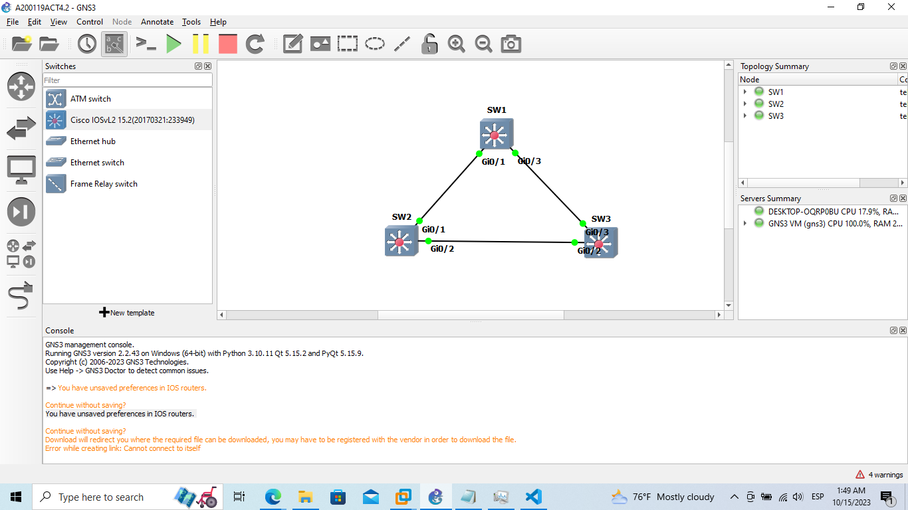
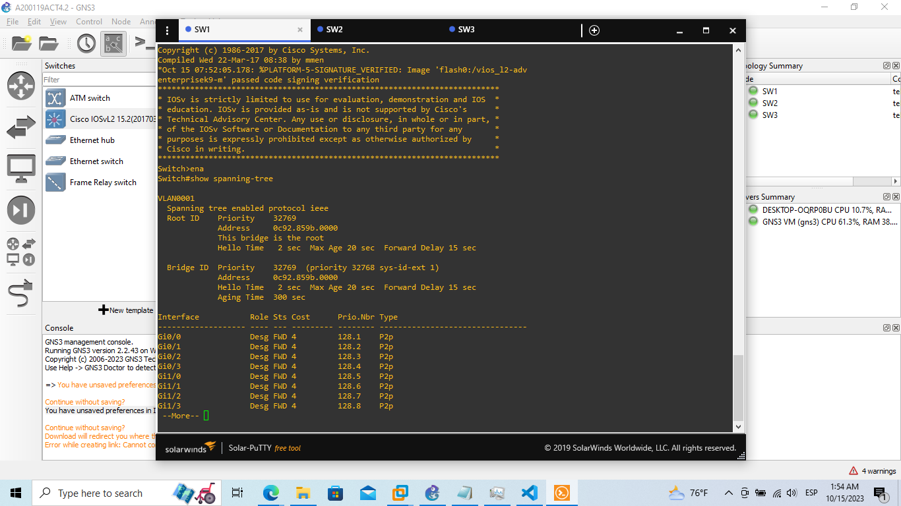
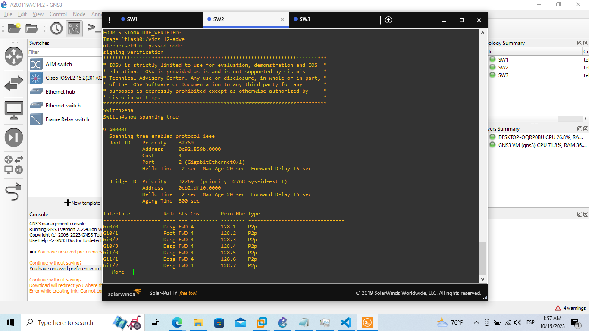
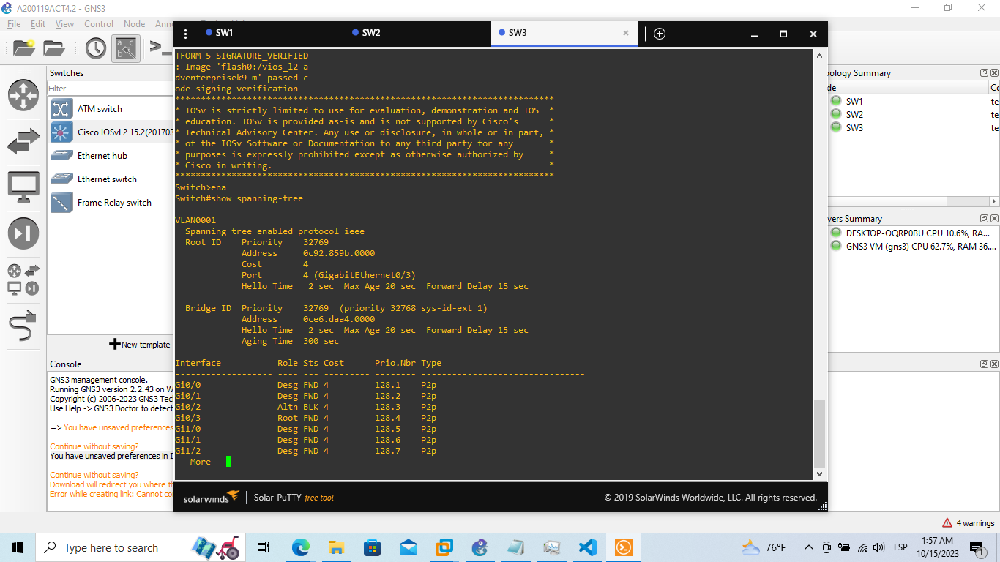
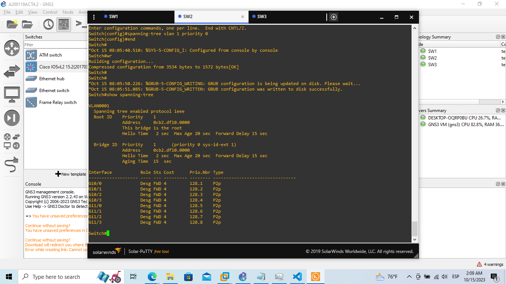

# Act. 4.2 Realizar un ejercicio de protocolo SPT en GNS3.

¡Importante!

De antemano disculpe la demora, tuve varios inconvenientes en mi equipo de computo referentes a la ejecución del GNS3, siendo mas especifico, en la ejecución de su maquina virtual.

Por ahora la solución temporal que he encontrado, es hacer una nueva partición en mi equipo, y ahí instalar todo el entorno de trabajo.

### Topología.

### Práctica.

aaa

### 1. Visualización de la jerarquía predeterminada.

Mediante siguiente comando identificamos el rol y prioridad de cada switch:

    show spanning-tree

Siendo que el principal será el que muestre el mensaje **_This bridge is the root_**, en este caso es SW1.

y los secundarios serán los restantes, en este caso SW2 y SW3, los cuales tienen la misma prioridad.

### 2. Asignación de la dirección IP en el switch root.

Una vez tengamos identificado a nuestro switch root, le agregaremos nuestra dirección ip, siendo en este caso la 192.168.200.119, haciendo referencia a mi matricula A200119.

    Switch#conf t
    Enter configuration commands, one per line.  End with CNTL/Z.
    Switch(config)#interface vlan 1
    Switch(config-if)#ip address 192.168.200.119 255.255.255.0
    Switch(config-if)#end
    Switch#wr
    Building configuration...

### 3. Reasignación del Switch root.

Por defecto, al nosotros inicializar nuestra red, está automáticamente asigna los roles de cada switch, sin embargo, en caso de que nosotros queramos asignar otro swich como root, tendremos que cambiar su numero de prioridad en la vlan correspondiente:

    Switch#conf t
    Enter configuration commands, one per line.  End with CNTL/Z.
    Switch(config)#spanning-tree vlan 1 priority 0
    Switch(config)#end
    Switch#
    Switch#wr
    Building configuration...
    Compressed configuration from 3534 bytes to 1572 bytes[OK]
    Switch#

Y verificamos los resultados utilizando nuevamente el comando:

    show spanning-tree

