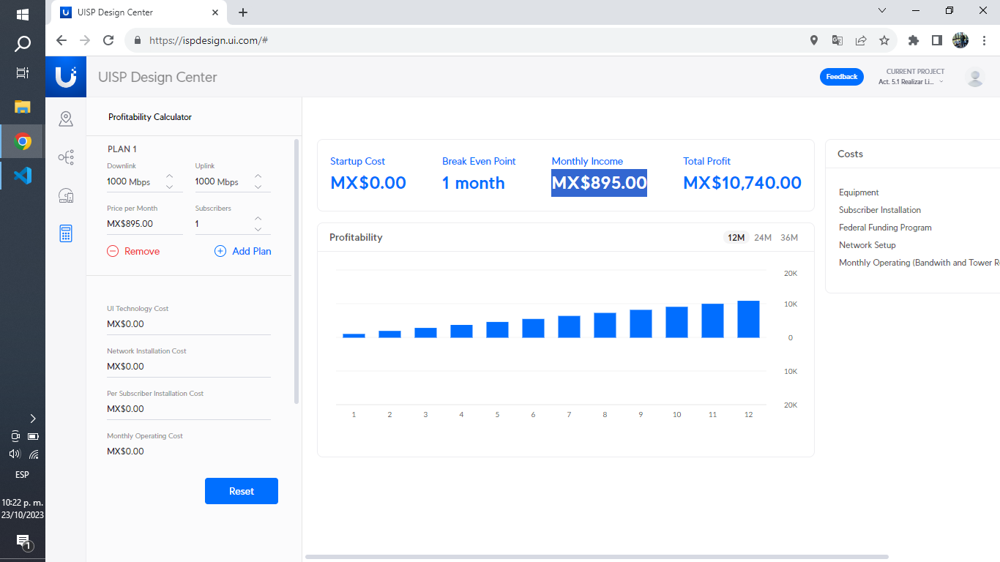
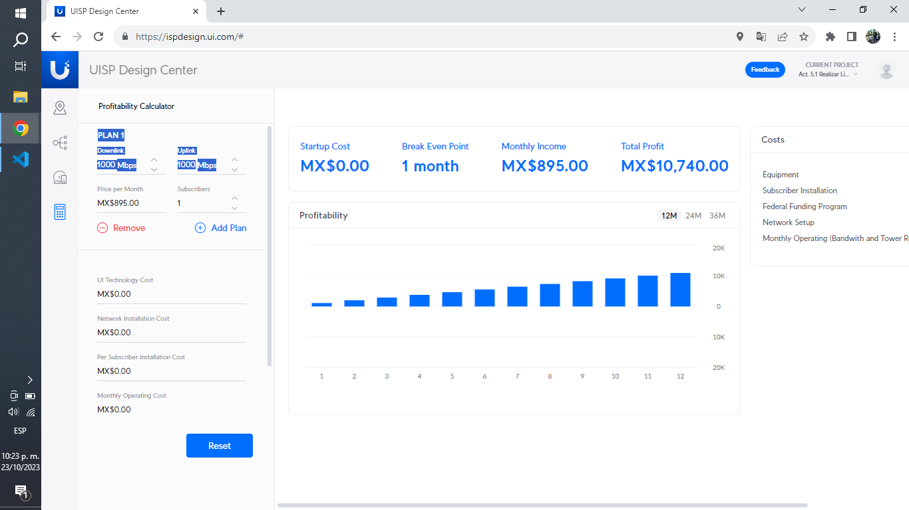
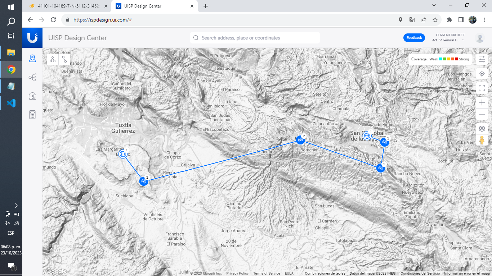

# Universidad Autónoma De Chiapas.

## Act. 5.1 Realizar Linea de vista de un Enlace WLAN punto a punto.

### **Catedrático:** DR. LUIS GUTIÉRREZ ALFARO.

### **Estudiante:** José Gilberto Guzmán Gutiérrez.

### LIDTS. 7ºM.

### A200119.

### Tuxtla Gutiérrez Chiapas. 21 de octubre del 2023.

# Act. 5.1 Realizar Línea de Vista de un Enlace WLAN punto a punto.

### Enlace a la práctica: [https://ispdesign.ui.com/#p=0e58ae7983ef41669564c9c59a9b04a1](https://ispdesign.ui.com/#p=0e58ae7983ef41669564c9c59a9b04a1)

# 1. Precio de la antena a utilizar:

[airFiber 5XHD](https://www.cyberpuerta.mx/Computo-Hardware/Redes/Antenas/Ubiquiti-Networks-Antena-airFiber-X-para-AF-5X-5GHz-30dBi-cp2.html?gclid=CjwKCAjws9ipBhB1EiwAccEi1LenRNW2qIvlB0YIXnb-pG5wZ2Egu8fgiyW6EU8dVR-aGtYIA3yyDRoCrO0QAvD_BwE) ➡ 10 Unidades \* 16369 ➡ 163690

[UISP Router](https://www.google.com/shopping/product/14682499871325409132?q=UISP+Router&sca_esv=575995033&rlz=1C1VDKB_esMX1070MX1070&biw=1304&bih=691&sxsrf=AM9HkKlN7vsJ488NEszcfHOLTSn8o_j02w:1698117942117&uact=5&oq=UISP+Router&gs_lp=Egtwcm9kdWN0cy1jYyILVUlTUCBSb3V0ZXJIAFAAWABwAHgAkAEAmAEAoAEAqgEAuAEDyAEA&sclient=products-cc&prds=eto:5775112053220116991_0,pid:7813926679784095738,rsk:PC_17863843260398977826&sa=X&ved=0ahUKEwjK2c6m3o2CAxVmIEQIHVL8De8Q8wIIiQs) ➡ 2 Unidades \* 4228 ➡ 8456

[UISP Switch](https://www.google.com/shopping/product/17316827803040074140?q=UISP+Switch&sca_esv=575995033&rlz=1C1VDKB_esMX1070MX1070&biw=1304&bih=691&sxsrf=AM9HkKkMNPzNnKF_C0eEJ5PwUDf2b4DxYw:1698117931658&uact=5&oq=UISP+Switch&gs_lp=Egtwcm9kdWN0cy1jYyILVUlTUCBTd2l0Y2hIywJQugFYugFwAHgAkAEAmAGFAaAB7wGqAQMwLjK4AQPIAQD4AQHCAgcQIxiwAxgnwgIMEAAYDRgYGIAEGLADwgILEAAYHhgNGBgYsAPCAg0QABgFGB4YDRgYGLADwgINEAAYCBgeGA0YGBiwA4gGAZAGCg&sclient=products-cc&prds=eto:15945164161739607273_0,pid:13445193830583737351&sa=X&ved=0ahUKEwiSguWh3o2CAxVwM0QIHfF0DZkQ8wIIxQs) ➡ 4 Unidades \* 8961 ➡ 35844

### Total: $207,990

# 2. Precio que le cobraría al Cliente Mensual y la antena:

### $895.00

Nota: Para determinar los costos de instalación es necesario llevar a cabo una investigación de campo.

# 3. Ancho de banda que mandaría al cliente:

### 1000 Mbps de subida y bajada.

# 4. Tiempo que recupera el capital de la antena:

- Tiempo de Recuperación = Costo Total de la Inversión / Ingresos Mensuales por Cliente.

- Tiempo de Recuperación = $207,990 / $895.00 ≈ 232.48 meses.

### 232.48 meses.

Nota: Esto sin considerar costos de instalación; para obtenerlos, es necesario llevar a cabo una investigación de campo.

# 5. Considerar las coordenadas punto A y B.

### Topología.

### Coordenadas.

El Jobo ➡ 16.703384, -93.103163

16.653022, -93.063595
16.728622, -92.764928
16.67743, -92.612239
16.724843, -92.604143

San Cristóbal ➡ 16.737036, -92.637619
